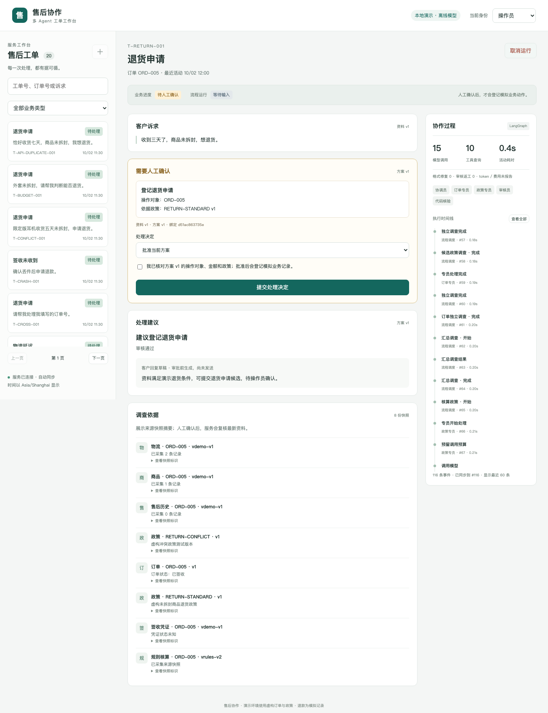
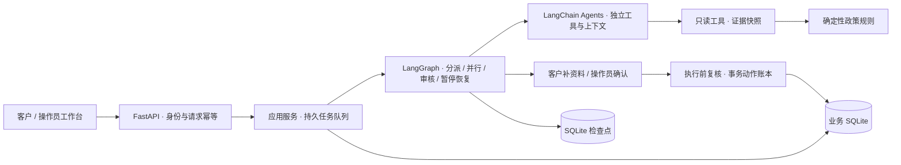

# AfterSales · 售后协作

[](https://github.com/weiwei-cup/after-sales-multi-agent/actions/workflows/ci.yml)


**基于证据的售后工单处理系统：多 Agent 调查与审核、人工审批、持久恢复和可追溯的业务执行。**

面向电商客服的物流延迟、签收未收到和退货申请，将订单调查、政策核算、建议生成与人工确认串成完整处理链路。客户补资料，操作员审核具体动作，系统保存依据、版本和执行回执，支持刷新、重启与请求重试。

当前发布使用离线脚本模型和虚构业务资料，无需 API 密钥即可演示完整流程。框架执行真实的工具调用、图调度、暂停恢复和 SQLite 事务；支付动作是模拟记录。真实模型适配器尚未实现。

[快速启动](#快速启动) · [演示指南](docs/demo.md) · [系统架构](docs/technical-design.md) · [API](docs/api.md) · [验证报告](docs/quality.md) · [文档中心](docs/README.md)



## 业务场景

| 场景 | 调查与判断 | 处理结果 |
| --- | --- | --- |
| 物流延迟 | 对照预计送达时间和物流记录，区分正常运输与超期 | 回复进度，或经确认登记物流调查 |
| 签收未收到 | 核验签收凭证、物流调查和客户陈述；缺资料时追问 | 有明确丢件依据且满足政策时，经确认登记模拟退款 |
| 退货申请 | 核验收货时间、商品类别/状态、历史申请和政策版本 | 经确认登记退货申请，业务状态进入“待客户寄回” |

## 核心能力

- **有据可查的建议**：结论绑定证据 ID 与来源版本；客户陈述和工具事实分别处理，规则由代码复算。
- **职责明确的 Agent 协作**：协调、订单调查、政策核算与审核拥有独立上下文和工具权限；订单与候选政策可并行调查，再核验依赖。
- **绑定具体方案的人工审批**：确认包含身份、待办、输入/方案版本和动作哈希；修改退款金额后重新审核和确认。
- **持久恢复与幂等执行**：图检查点、人工回答、HTTP 请求回执和动作账本各自持久化；动作提交后进程退出，恢复返回已有回执。
- **有限执行**：全运行共享模型/工具调用、返工、并发、token 预留和活动时间预算，恢复不会重置额度。
- **可操作的工作台**：工单创建、筛选、补资料、审批、取消、恢复、证据摘要与执行时间线，支持窄屏。
- **可复现的架构对照**：单 Agent 和多 Agent 共用业务规则、审批与动作保障；先保存观察，再读取独立预期评分。

## 快速启动

需要 **Python 3.12、[uv](https://docs.astral.sh/uv/getting-started/installation/)、macOS 或 Linux**。

```bash
git clone https://github.com/weiwei-cup/after-sales-multi-agent.git
cd after-sales-multi-agent
uv sync --locked --python 3.12
uv run --locked after-sales demo --port 8000
```

打开 [工作台](http://127.0.0.1:8000/) 或 [交互式 API 文档](http://127.0.0.1:8000/docs)。默认使用临时资料，正常停止后清理；不需要模型密钥。

**第一条演示路径**：客户 A → `T-NOTRECEIVED-002` → 开始处理 → 切换操作员 → 核对 ¥100.00、订单与政策 → 勾选确认并提交 → 查看模拟退款回执。刷新页面不会重复登记退款。更多路径见 [5 分钟演示指南](docs/demo.md)。

需要保存工单与审批，使用固定目录启动；再次执行同一命令可以继续处理：

```bash
uv run --locked after-sales demo --data-dir var/demo --port 8000
```

演示时钟固定为 2026-10-02 12:00 Asia/Shanghai，使资料中的时间窗口可重复。采用实际时钟的服务启动、配置和备份见 [运行指南](docs/operations.md)。

## 系统架构



Agent 负责调查与建议；代码核验事实、权限和政策，操作员批准动作，事务执行器产生业务效果。单机服务使用一个 HTTP 进程和有界执行线程；业务库与检查点库共同支持恢复。[完整架构与取舍](docs/technical-design.md)。

## 验证结果

发布前验证包含 **556 项离线测试、12 项真实 Chromium 测试**。独立评估使用 30 个案例、两种架构、每例三次重复，共 180 次观察：

| 数据集 | 单 Agent | 多 Agent |
| --- | --- | --- |
| 开发集 | 54/60（90%） | 51/60（85%） |
| 留出集 | 27/30（90%） | 27/30（90%） |

180 次观察中，实际跨客户读取、未确认写入、重复业务动作和超额退款四类关键错误均为 0；21 次业务评分失败完整保留。离线脚本结果体现流程行为，不证明真实模型质量或生产收益。实际 token 与费用未报告，保留为 `null`。[验证方法、已知问题与报告](docs/quality.md)。

```bash
uv run --locked ruff check .
uv run --locked ruff format --check .
uv run --locked python scripts/check_docs.py
uv run --locked pytest
```

浏览器测试和完整评估的安装与复现命令见 [评估说明](evals/README.md)。

## 项目结构

```text
src/after_sales/
  agents/        Agent 工具循环、角色、审核与结构化输出
  workflows/     单 / 多 Agent 图、并行汇合、人工介入与恢复
  domain/        业务模型与确定性政策规则
  tools/         可信工具上下文、证据快照与有界查询
  repositories/  SQLite 迁移、运行记录、调用预算和动作账本
  services/      应用服务、工作流分派与公开结果投影
  api/           HTTP 接口、身份范围与请求契约
  web/           中文工单工作台
  evaluation/    故障执行、观察保存与独立评分
tests/           业务、契约、恢复、并发、HTTP 与浏览器验证
fixtures/        版本化模拟业务输入
evals/           独立预期、留出案例与归档报告
docs/            架构、演示、运行、API、设计决策与开发历史
```

## 文档与后续

- [演示指南](docs/demo.md)：三类业务、金额修改、刷新与重启。
- [架构说明](docs/technical-design.md) / [设计决策](docs/decisions/README.md)：状态、证据、审批、事务与评估取舍。
- [运行指南](docs/operations.md) / [API 说明](docs/api.md)：配置、持久数据、协议与运行边界。
- [技术展示提纲](docs/showcase.md)：适合面试的项目介绍、代码入口与现场演示顺序。
- [路线图](docs/roadmap.md) / [变更记录](CHANGELOG.md) / [贡献指南](CONTRIBUTING.md)。

当前可运行范围是单机演示与工程验证：公开演示令牌、模拟业务动作、离线模型。真实认证、真实模型、支付对接和分布式部署列入路线图。开发记录与原实施计划保存在 [历史归档](docs/history/README.md)，阶段标签保留用于追溯。
