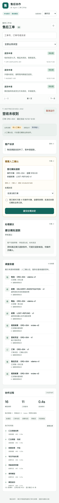

# 5 分钟演示指南

演示围绕“为什么可以执行这个动作，以及如何保证它只执行一次”展开。先展示业务，再展示协作与实现证据。

## 启动与准备

```bash
uv sync --locked --python 3.12
uv run --locked after-sales demo --port 8000
```

打开 [工作台](http://127.0.0.1:8000/)。默认从新的临时资料开始；固定业务时间为 2026-10-02 12:00 Asia/Shanghai，模型无需密钥。正常停止会清理临时资料。

演示身份：客户 A、客户 B、操作员。客户只能查看自己的工单与订单；操作员可查询所有演示工单并确认动作。先使用一条完整路径，再挑选一项恢复/幂等场景展示。

## 路径一：签收未收到 → 追问 → 模拟退款

1. 使用客户 A 新建“签收未收到”工单，填写“物流显示签收，但我没有收到，请帮我核实”，暂不填写订单号。
2. 点击“开始处理”，系统生成客户补充待办。刷新页面，待办仍存在。
3. 补充 `ORD-004`，提交。查看调查依据、订单丢件事实、`LOST-REFUND v1` 和 ¥100.00 候选。
4. 切换为操作员，核对订单、政策、金额与方案版本，勾选阅读确认并批准。
5. 查看 1 条模拟退款回执，业务状态“已办结”。刷新仍显示同一回执。

如果只有两分钟，直接使用客户 A 的 `T-NOTRECEIVED-002`，跳过创建与追问。

## 路径二：物流延迟 → 登记调查

客户 B → `T-DELAY-002` → 开始处理 → 查看预计送达时间、物流事实与政策 → 操作员确认。最终为“处理中”，回执为“登记物流调查”。流程结束并不意味着物流问题已经解决。

## 路径三：窗口内退货 → 待寄回

客户 B → `T-RETURN-001` → 开始处理 → 核对 `ORD-005`、商品状态与 `RETURN-STANDARD v1` → 操作员确认。最终为“待客户寄回”，系统登记申请，尚未履约。

## 可选展示：方案修订

在退款待办中选择修改金额为 `90.00`，提交后查看新方案版本。旧确认不能授权新金额；需要重新阅读、勾选并批准。最终回执只有一次 ¥90.00 模拟退款。请使用尚未批准的工单或重新启动临时演示。

## 可选展示：重启后继续

```bash
uv run --locked after-sales demo --data-dir var/demo --port 8000
```

将工单处理到待人工确认后正常停止，再执行同一命令。原工单、运行、待办与证据保留，可以批准原方案。`--data-dir` 始终使用其中的 `business.sqlite` 与 `checkpoints.sqlite`；与默认日常库路径分开。

正常重启可以现场展示；动作提交后强制退出的窗口由 [恢复测试](../tests/test_parallel_recovery.py) 和 [评估案例 C16](../evals/README.md) 提供可重复证据。

## 展示时说明什么

- 工具结果和政策版本支撑建议；客户陈述不自动成为已核验事实。
- 专员职责与工具权限可从协作时间线和代码核对。
- 确认绑定具体方案；HTTP 重试和业务动作分别有幂等机制。
- 当前模型为 ScriptedChatModel，支付和消息通道为模拟范围；真实模型质量与生产业务收益尚未测量。


