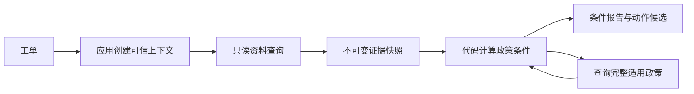

# 第 002 轮：工具、规则与证据（P02）

日期：2026-10-02；依赖：P01；下一轮：P03 单 Agent 基线。

## 本轮业务目标

系统现在能够针对一个工单，用可信订单资料计算退货和退款条件，并给每份资料留下可复核的证据引用。处理相同输入时，规则结果由固定业务时间和明确政策版本决定。本轮模型调用为 0，所有动作都只形成候选。

## 六个实现步骤

1. **定义输入与返回契约**：[contracts.py](../../src/after_sales/tools/contracts.py) 提供严格输入、`ToolResult`、错误码、可信 `ToolContext` 与证据引用。extra 字段被拒绝，`customer_id` 不出现在工具参数中。
2. **绑定可信身份**：[service.py](../../src/after_sales/tools/service.py) 读取并核对工单，创建独立 `ToolSession`。订单号必须来自当前工单，查询时 repository 再核验归属；新增商品查询也先检查归属。
3. **实现确定性规则**：[rules.py](../../src/after_sales/domain/rules.py) 计算政策有效期、商品范围、退货窗口、未拆封、确认丢件、退款余额和已有申请。每个条件都有值和原因，不靠文本关键词批准退款。
4. **建立不可变证据**：[evidence.py](../../src/after_sales/tools/evidence.py) 保存带来源、版本、时间和工单/会话范围的快照。模型评估时只传引用，程序读取保存的事实；重复读取去重，修改工具返回字典不能修改已保存证据。
5. **包装 LangChain 工具**：10 个异步 `StructuredTool` 使用同一服务和 Pydantic schema。返回 JSON，`metadata.result_schema` 提供共同契约；真实 `ainvoke(tool_call)` 测试验证 `ToolMessage.tool_call_id` 匹配。
6. **接入只读调查 CLI**：[inspection.py](../../src/after_sales/tools/inspection.py) 顺序调用这些服务，读取事实与候选政策、计算各类动作条件。`inspect` 输出人类可读报告或 JSON，业务库前后快照保持相同。

调查链路：



该图表示逻辑依赖，P02 尚未将这条调查链路实现为 Agent/LangGraph 业务图。

## 演示与预期

```bash
./scripts/dev run --locked after-sales seed --dataset demo
./scripts/dev run --locked after-sales inspect --ticket T-RETURN-001
./scripts/dev run --locked after-sales inspect --ticket T-RETURN-002
./scripts/dev run --locked after-sales inspect --ticket T-API-DUPLICATE-001
./scripts/dev run --locked after-sales inspect --ticket T-UI-RESUME-001
./scripts/dev run --locked after-sales inspect --ticket T-CONFLICT-001 --json
./scripts/dev run --locked after-sales inspect --ticket T-NOTRECEIVED-001 --json
./scripts/dev run --locked after-sales inspect --ticket T-NOTRECEIVED-002 --json
./scripts/dev run --locked after-sales inspect --ticket T-CROSS-001 --json
./scripts/dev run --locked after-sales inspect --ticket T-MISSING-001 --json
```

| 工单 | 本轮实际计算结果 |
| --- | --- |
| T-RETURN-001 | 收货三天、未拆封、类别符合、没有历史申请：eligible |
| T-RETURN-002 | 收货七天加一秒：return_window=false，ineligible |
| T-API-DUPLICATE-001 | 恰好七天：return_window=true，eligible；API 尚未实现 |
| T-UI-RESUME-001 | 已有 H-RETURN-020：existing_application；界面恢复尚未实现 |
| T-CONFLICT-001 | 72/168 小时政策同时有效：policy_conflict，保留两份条件和来源 |
| T-NOTRECEIVED-001 | 凭证明确 missing、未确认丢件：可调查，退款不符合条件 |
| T-NOTRECEIVED-002 | 可信调查确认丢件：退款候选 eligible；不执行退款 |
| T-CROSS-001 | NOT_OWNED，无对方资料或证据 |
| T-MISSING-001 | MISSING_REFERENCE，无猜测订单 |

JSON 包含 `results` 和 `evidence`；每个结果遵循 `ok/data/evidence_refs/error`。`query_ok` 表示资料与评估工具是否成功，不代表动作资格。预期业务缺口仍以 exit 0 返回调查报告；工单不存在、数据库或配置初始化失败则 exit 2。

## 如何验证

```bash
./scripts/dev run --locked --offline ruff check .
./scripts/dev run --locked --offline ruff format --check .
./scripts/dev run --locked --offline pytest
./scripts/dev build --wheel --offline --out-dir .tools/dist
```

本地结果：132 passed，其中新增 72 个测试实例，ruff 与格式检查通过，wheel 构建通过。独立锁文件环境重新安装实际 wheel，在另一个工作目录运行 inspect 成功；安装包包含工具与模拟资料，不包含 gold 或运行时数据库。20 个既有工单的只读调查均完成：18 个查询成功，缺订单号与跨客户 2 个返回预期资料错误；所有评估的输入引用通过校验。

| 测试文件 | 要验证的业务边界 |
| --- | --- |
| test_policy_rules.py | 七天边界、超一秒、未收货/缺时间、部分退款 8900 分上限、负数/零/超额、未知事实、已有申请、可信丢件来源 |
| test_readonly_tools.py | 实际 SQLite 查询、同客户另一订单限制、跨客户、伪造参数、LangChain ToolMessage、政策遗漏、证据存在/版本/范围/类型、超时容量、长度限制、只读不变更 |
| test_inspection_cli.py | 文字/JSON 报告、缺订单号、跨客户、工单不存在、无效查询配置 |
| test_offline_guard.py | asyncio 的 Unix socket 例外不放开 IPv4/IPv6 网络 |

首次异步集成测试在 `asyncio.run → socket.socketpair → pytest_socket.GuardedSocket` 处失败；插件源码和 [官方使用说明](https://github.com/miketheman/pytest-socket) 支持 `--disable-socket --allow-unix-socket`。采用这组配置后完整套件通过，并增加互联网 socket 仍被禁止的检查。此处是本地测试调用，无 HTTP 请求或服务 traceId。

GitHub 实现提交：`86fa6a49e0094b19f313fd0cecfeff3030f3cefd`。[P02 实现 CI](https://github.com/weiwei-cup/after-sales-multi-agent/actions/runs/37014887512) 为 success，完成 Linux 新环境锁定安装、132 个离线测试、普通与冲突工单 inspect 演示、wheel 构建。阶段快照：[phase-p02](https://github.com/weiwei-cup/after-sales-multi-agent/tree/phase-p02)，包含本轮记录与计划完成状态。

## 本轮需要理解的概念

| 概念 | 本项目中的例子 |
| --- | --- |
| 输入 schema 与运行时上下文 | 模型传订单号，应用注入 customer_id 和业务时间 |
| 工具与 Agent 的关系 | 工具已可由 LangChain 调用；模型选择与循环在 P03 实现 |
| 事实与候选参数 | 实付/收货时间不能由模型输入；退款候选金额可以输入但需计算校验 |
| 三值规则 | 查询失败不是“没有历史”；缺时间不能当作超时限拒绝 |
| 冲突与优先级 | 两份政策互相限制时保留冲突，不自行假设哪个优先 |
| 证据溯源与快照 | 引用绑定工单/会话、版本与内容；不能复用另一次调查的 ID |
| 超时与取消 | 返回超时不等于后台线程已停止；容量必须到实际读结束才释放 |

## 当前限制与下一轮

证据保存在调查会话内存，JSON 仅导出查看；跨进程恢复在 P06 实现。返回 eligible 也不执行动作，模拟写入与人工确认分阶段加入。查询容量目前按会话限制，全局调度与统计在 P07 实现。测试中的超时注入通过替换只读适配器完成，尚未实现案例文件故障脚本的通用执行器。

本轮验证代码不会把外部描述当作业务事实，尚未验证真实模型遇到提示注入时的行为。第 003 轮用兼容 LangChain 的 ScriptedChatModel 与 create_agent，完成模型→工具→模型循环、结构化建议和最小调用记录，复用本轮工具和规则。
