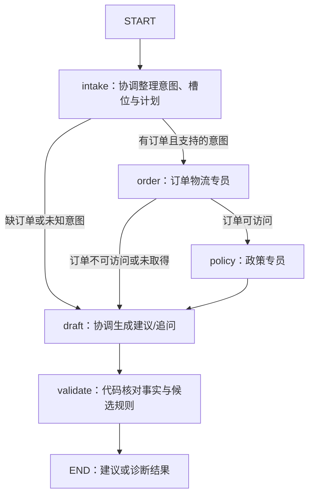

# 第 004 轮：多 Agent 串行主图

日期：2026-10-02

对应计划：P04

状态：已完成并上传 GitHub，本地与远程 CI 通过，阶段快照为 phase-p04。

## 本轮业务结果

新增客服协调、订单物流、售后政策三个角色；协调分 intake 与 draft 两次调用，两个专员各调查一次。外层 LangGraph 决定谁在何时运行，内层 create_agent 完成各角色自己的模型/工具循环，最后交给代码校验。



实际编译图的 Mermaid 保存在 [p04-serial.mmd](../graphs/p04-serial.mmd)。三类案例的实测节点、完整 run ID 和角色调用数保存在 [p04-demo-traces.json](../graphs/p04-demo-traces.json)。这是离线观察记录，不是 gold 或可恢复检查点。

| 工单 | 多 Agent 建议 | 节点轨迹 | 模型 / 业务工具调用 |
| --- | --- | --- | --- |
| T-DELAY-001 | inform_progress | intake→order→policy→draft→validate | 12 / 8 |
| T-NOTRECEIVED-002 | propose_refund，10000 分候选 | 同上 | 12 / 9（复算 1） |
| T-RETURN-001 | propose_return | 同上 | 11 / 8（复算 1） |
| T-MISSING-001 | request_information，补订单号 | intake→draft→validate | 2 / 0 |
| T-CROSS-001 | human_review，核对归属 | intake→order→draft→validate | 4 / 1 |
| T-CONFLICT-001 | human_review，政策冲突 | intake→order→policy→draft→validate | 11 / 7 |

所有动作数为 0；工单业务状态和余额没有变更。unknown 意图的受控测试同样走 intake→draft→validate，不调用订单或政策工具。没有审核 Agent、interrupt、恢复或并行，这些按后续阶段推进。

## 按步骤理解实现

### 1. 定义主图 State 与有限路径

`workflows/contracts.py` 定义 TicketState，字段为 schema/run/ticket ID、输入、intake、order_findings、policy_assessment、proposal、validation、route、status、node_trace。各节点返回部分更新，串行字段使用默认覆盖；本轮不需要并行 reducer。

State 只保存 JSON 资料。连接、repository、ToolSession、模型、预算对象由 MultiRuntime 和节点闭包持有；子图 messages 也不写入 State。节点边界先校验 Pydantic 输出再转换为 JSON。测试做 JSON 和 LangGraph JsonPlusSerializer 往返，不据此宣称已支持恢复。

| 已完成节点 | 允许下一节点 | 判断来源 |
| --- | --- | --- |
| START | intake | 固定边 |
| intake | order / draft | 已核对的声明意图、订单引用和计划 |
| order | policy / draft | 实际 get_order 结果及核对后的摘要 |
| policy | draft | 固定边 |
| draft | validate | 固定边 |
| validate | END | 无动作执行入口 |

Route 是枚举，TRANSITIONS 是允许的转换表；模型只能输出契约，不生成节点名或 SQL。父图包装节点记录开始/完成/失败，失败报告保留此前节点的结果。

### 2. 协调整理槽位与固定计划

`agents/roles.py` 的 intake 脚本读取本工单声明的类型、supplied_order_id 和客户陈述，输出 IntakeResult：意图、IntakeSlots、缺口、InvestigationPlan。客户陈述仍是未核验资料；工具返回才作为事实。

支持的意图且订单引用存在时，计划只有 order-facts→policy-rules 两项任务，政策依赖订单；任务的 owner、depends_on、tools 固定。父图核对协调输出与输入和计划是否一致，不能猜订单或改客户陈述。未知意图交人工，缺订单号提出问题。

当前离线方案使用已声明类型，不评估自由文本 NLU；真实模型接入仍延期。增加新的业务意图或任务需要显式扩展契约和图，不只修改提示词。

### 3. 订单专员只调查事实

父图给订单角色的输入只有 ticket_id、order_id、调查问题；业务工具仅为 get_order、get_order_products、get_tracking、get_delivery_proof、get_after_sales_history。客户身份和会话仍由 ToolSession 注入。

OrderInvestigation 输出 outcome、事实快照和 tool_errors。每条事实含 source_type/source_id/ref/facts；父图先查会话证据，确认引用、版本、来源和内容，再核对摘要与实际子图工具结果。模型即便给出合法 JSON，也不能加上不存在的事实或改写实付金额。

get_order 失败后只交付 unavailable 摘要，不继续查物流或政策。其他查询失败保留明确错误，不变成空记录；规则需要相应资料时继续得到 unknown 或资料缺口。

### 4. 政策专员接收事实与引用

政策输入只有 ticket_id、order_id、intent、order_findings。它不接收用户对话或订单角色的内部模型消息；工具限于 search_policies、get_policy、evaluate_policy。

脚本从订单摘要取真实 order/products/tracking/history 引用，再把引用交给 evaluate_policy；不把客服文本当作 received_at 或 paid_cents。PolicyAssessment 保留适用政策快照、规则 assessment 和查询错误，父图做同样的来源/内容及实际工具结果核对。

当前脚本先 search_policies，再逐个计算返回的候选动作。get_policy 已在允许集合，当前标准样例的 search 返回完整条款，因此无需再次读取。冲突/已有申请/未知条件仍沿用 P02 的确定性规则。

### 5. 包装子图，隔离消息

`workflows/serial.py` 的父图节点调用 create_agent.ainvoke，显式投影输入后仅提取 structured_response；没有将 TicketState 直接传给子图。

| 角色调用 | 看到的输入 | 业务工具 | 结构化输出 |
| --- | --- | --- | --- |
| coordinator / intake | 本工单类型、订单原始引用、客户/客服资料 | 无 | IntakeResult |
| order_specialist / order | 当前任务订单与调查问题 | 5 个订单只读工具 | OrderInvestigation |
| policy_specialist / policy | 已核对订单摘要与引用、意图 | 3 个政策工具 | PolicyAssessment |
| coordinator / draft | intake、订单和政策摘要 | 无 | ResolutionProposal |

每次调用新建模型与消息历史，协调 intake 的内部 messages 也不直接复制到 draft。JSON 运行日志汇总多个角色的消息并标注 agent_role，方便回看；日志汇总与上下文共享是两件事。测试检查各角色第一次生成只有自己的 HumanMessage，没有其他角色的 ToolMessage。

主图 Mermaid 只展示父图节点，内层实际工具循环由角色消息/事件证明。本实现采用不同 schema 的包装调用模式；可对照 [LangGraph Subgraphs](https://docs.langchain.com/oss/python/langgraph/use-subgraphs)。

### 6. 起草并进行独立代码校验

协调 draft 根据已核对摘要输出与 P03 一样的 ResolutionProposal。离线装配函数复用，以保持同样的业务条件与候选规则；各架构的 messages 和运行过程仍各自独立。

validate 节点复用事实声明、证据范围/版本、动作 assessment、完整政策和候选金额复算。schema 合法的 10001 分退款仍会因余额只有 10000 分得到 validation_failed、accepted_proposal=null，保留原 proposal 和问题。

accepted_proposal 通过的是调查校验，executable 仍为 false。P05 才引入审核、用户补充、操作员确认；P06 才加入刷新事实后的模拟写动作。

### 7. 预算、修复与诊断按 run 累计

三个角色共用一份 RunTelemetry，默认模型上限 20、业务工具上限 30、schema 修复上限 1。工具数包含 validate 的复算；角色切换不重置。最终结构化输出计入模型次数，其合成工具不算业务工具。

有限脚本为明确的提前结束路径增加 schema 反馈分支，例如跨客户订单 unavailable 摘要写错字段后，可以修复一次而不追加业务查询；政策查询失败后的摘要也如此。未定义的工具序列或未绑定工具仍明确失败。

一次订单摘要修复用完预算后，政策摘要再次无效会有限停止；不是每个角色各多获得一次重试。模型/工具时限沿用 P03 / P02，完整运行时间与 token 软预算仍在 P07。未上报 token 时为 null，不生成费用数字。

报告保存最后完成的节点、角色输入/输出、失败节点和安全错误类型；不保存原始异常中的测试密钥。失败后保留静态诊断，不提供 resume 接口。

## 演示和回看

新环境先 seed，已有日常演示库无需 reset：

```bash
./scripts/dev run --locked after-sales seed --dataset demo
./scripts/dev run --locked after-sales run --ticket T-DELAY-001 --architecture multi --model scripted
./scripts/dev run --locked after-sales run --ticket T-NOTRECEIVED-002 --architecture multi --model scripted
./scripts/dev run --locked after-sales run --ticket T-RETURN-001 --architecture multi --model scripted
./scripts/dev run --locked after-sales run --ticket T-MISSING-001 --architecture multi --model scripted
./scripts/dev run --locked after-sales run --ticket T-CROSS-001 --architecture multi --model scripted
```

终端打印实际报告路径，替换下面的占位路径：

```bash
./scripts/dev run --locked after-sales report show var/runs/运行ID.json --json
./scripts/dev run --locked after-sales report show var/runs/运行ID.json --events-only
./scripts/dev run --locked after-sales run --ticket T-RETURN-001 --architecture single --model scripted
./scripts/dev run --locked after-sales run --ticket T-RETURN-001 --architecture multi --model live --json
```

默认 architecture 仍为 single，学习快照和原基线命令保持可用。baseline-run-v1 与 multi-run-v1 通过 schema_version 区分，读取先校验完整报告。已有路径拒绝覆盖，completed/skipped 退出码 0，运行/校验失败为 1，配置/文件/工单错误为 2。live 显式 skipped，角色调用为 0。

## 验证结果

本地 **250 passed**，P04 新增 **49 个实例**：test_multi_agent.py 44 个，test_multi_cli.py 5 个。默认禁止互联网 socket，测试使用临时 SQLite，不改日常演示数据。

| 验证内容 | 实际结果 |
| --- | --- |
| 20 个已有工单基础事实与业务结果 | 正常与跳过分支通过，运行前后 DB dump 一致 |
| 未知意图 | 不进入两个专员，human_review |
| 工具隔离 | 白名单绑定正确，跨角色工具请求在执行前失败 |
| 上下文投影 | 政策拿到实际订单事实/引用，不接收客户对话与订单内部 ToolMessage |
| 摘要伪造 | 事实、引用、协调订单替换均不能继续形成接受结果 |
| schema 与预算 | 正常/提前结束修复、持续失败、跨角色上限与最后复算通过 |
| 查询错误与程序异常 | 缺口保留，原始异常敏感占位值不落报告，部分状态保留 |
| State 序列化 | JSON 与 LangGraph serializer 往返一致，无依赖对象或密钥 |
| 单/多建议契约 | 三类样例 decision/动作/金额/政策一致 |
| CLI | 多报告保存、旧/新读取、事件、错误退出码、禁止覆盖和 live 跳过通过 |

案例名含超时、崩溃、过期确认等的 20 条工单测试仍只跑基础事实；故障行为通过独立受控脚本或查询替换验证。未实现通用故障执行器、审核、恢复、幂等或 HTTP。

增补测试时有一次收集失败：Ruff F821 和 pytest NameError 指向新测试中未导入的 Role。补上导入，并让格式/lint 的退出码决定是否运行 pytest 后，完整回归通过。按用户指定 SherlockPlatform 完成 SPAR；证据为本地命令、异常位置和实际源码，无 HTTP 请求、traceId 或生产查询。

wheel 构建通过，归档内全部 31 个 Python 模块与源文件一致；不含运行库、gold、测试或工具缓存。独立锁定依赖环境重新安装，在另一工作目录运行多 Agent 退货，得到 11 次模型、8 次工具（复算 1）、完整正常轨迹和 0 动作。uv 缓存位置提示经实际归档检查未发现缓存混入。

GitHub 实现提交：`9948cb8616c5caf71342ca6ac1cd9676fc63f975`。[P04 实现 CI](https://github.com/weiwei-cup/after-sales-multi-agent/actions/runs/37021920152) 为 success，在 Linux 新环境完成锁文件安装、250 个离线测试、三类多 Agent 演示、缺订单分支、报告回看、单 Agent 回归和 wheel 构建。阶段快照：[phase-p04](https://github.com/weiwei-cup/after-sales-multi-agent/tree/phase-p04)，包含本轮学习记录与计划完成状态。

## 观察与下一轮

| 架构 | 物流进度模型调用 | 丢件退款模型调用 | 退货模型调用 |
| --- | --- | --- | --- |
| P03 single | 9 | 9 | 8 |
| P04 multi | 12 | 12 | 11 |

三个角色多出 3 次模型调用，业务工具数和建议一致。这个结果说明职责交接带来流程开销，不能证明语言质量改善；真实模型质量、时延和费用对照在 P10。

第 005 轮 / P05 增加审核角色、ReviewResult、定向补查/改写的有限循环，以及 customer_info / operator_decision 两种待办。先验证同进程 interrupt/resume 和确认版本绑定，动作和重启恢复继续留给 P06。
