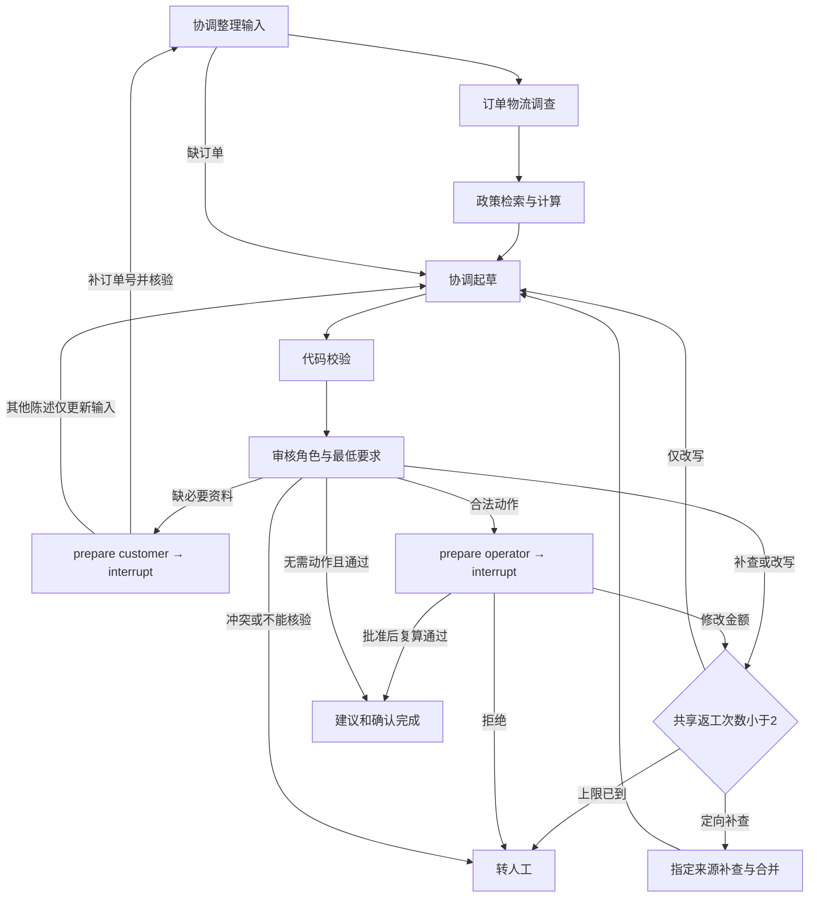

# 第 005 轮：审核、返工、追问与人工确认

日期：2026-10-02～2026-10-03；对应计划：P05。

状态：已完成并上传 GitHub；本地与远端 370 个离线测试通过，阶段快照为 phase-p05。

## 本轮业务结果

客服协调、订单物流、售后政策、审核四种职责形成闭环。审核可以让协调改写，也可以只让指定专员补查；必要资料缺失时暂停等客户，合法动作候选暂停等操作员。批准仅记录确认结果，业务执行数为 0。



实际编译图见 [p05-reviewed.mmd](../graphs/p05-reviewed.mmd)，实跑 run ID、每次恢复的版本、节点和统计见 [p05-demo-traces.json](../graphs/p05-demo-traces.json)。概念图省略了部分内部节点；以实际编译图和运行记录为准。

## 按步骤理解实现

### 1. 定义审核输出，保留代码兜底

`agents/contracts.py` 增加 ReviewResult、ResearchTask、PendingInput、ActionBinding、ResumeInput、Confirmation 和 review-run-v1 报告。审核意见为 accept / research / revise / customer_info / handoff，非接受意见必须有问题说明，改写必须有具体指令，补查必须属于指定角色的有限工具集合。

`agents/review.py` 的脚本以实际工具结果生成审核输出；默认先 validate_evidence_refs，再返回 ReviewResult。审核工具同时允许 get_evidence，不能读取其他订单或调用写工具。协调拿到 review_feedback / validation_feedback，政策补查拿到反馈和最新事实；每次 create_agent 仍使用独立 messages。

`workflows/reviewed.py::minimum_review` 依据可信交接 DTO 和代码校验计算最低要求。超余额、假引用等硬失败即便模型返回 accept，仍进入有限返工。草稿采用当前结果对应的中文模板；“退款已经到账”等不被事实支持的承诺只触发改写。当前没有真实模型和通用自然语言语义审核。

### 2. 让反馈改变调查路线

repair_count 最多 2，代码校验、审核改写/补查、操作员金额修改共享；模型与工具预算也不重置。schema 格式修复沿用 P03 的独立全局计数。两次上限是最大值，预算或交接失败可能更早交人工。

订单补查只绑定 ResearchTask 指定工具，把实际结果合并到 OrderInvestigation：替换已查来源，保留其他快照和错误。凭证失败后，只重查 get_delivery_proof，政策 assessment 保留。若重查订单、商品、物流或历史，则重新计算政策依赖，防止旧判断继续引用旧输入。纯措辞问题只调用协调与审核，不重查订单。

### 3. 区分追问与确认

customer_info 只询问必要且客户可以补充的字段；不让客户修复 tool_service、内部政策或历史服务。回答需要覆盖本次列出的字段，不能多填客户 ID、动作或批准。订单号先检查格式，再按工单原客户范围核验。

客户回答产生 input_revision。订单号改变后重新整理输入并调查；其他回答更新输入陈述，保留可信事实。若回答后仍缺可信依据，转人工核验，不反复问同一字段。收货时间、未拆封或丢件陈述不能直接写入订单快照或授权退款。

operator_decision 展示完整动作、整数分金额、稳定 action_id 和内容哈希。envelope 还绑定 pending_id、run/ticket ID、input_revision、proposal_revision 和完整 proposal_hash。错误角色、身份、待办、旧版本或内容均在消费前拒绝。

操作员可 approve / reject / revise。revise 当前支持修改退款金额，要求正整数分、不同于旧金额、在已核验余额内；不支持修改订单或编造事实。新方案递增 proposal_revision，保持同逻辑动作的 action_id，改变 content_hash、proposal_hash 和 pending_id；旧批准失效，重新审核后再次展示。

### 4. 用真实 interrupt 和内存检查点恢复

InMemoryReviewRun 拥有编译图、InMemorySaver、ToolSession、证据、预算、待办历史、确认记录和恢复锁。prepare 节点先建立稳定待办并更新图状态，wait 节点调用 `interrupt(pending)`。`resume` 先核验 envelope，再提交 `Command(resume=envelope)`。

恢复会重新进入 wait 节点，因此待办创建放在前面的 prepare 节点，稳定 ID 注册也做去重。GraphInterrupt 单独记录为 node_interrupted，不算 node_failed。一次有效回答只消费一次待办；并发重复提交由 asyncio.Lock 串行验证，后一个请求被拒绝。

内存对象关闭后不能恢复。非交互运行保存 paused JSON 后退出；文件可查看，不能当恢复输入。当前 CLI 没有跨进程 resume 命令，checkpoint_db_path 在 P06 才使用。

### 5. 确认与业务完成分开

批准后用共享预算再次复算当前快照规则；检查通过才把 proposal 放入 accepted_proposal。拒绝或失败转 handed_off，没有 accepted_proposal。候选始终 candidate_only，executed_actions=[]，数据库 dump 前后相同。

review-run-v1 报告核对当前图状态、版本、待办内容哈希、动作候选与确认对应关系；已完成的动作建议必须有当前方案的批准。返回报告经 JSON 往返，外部改动报告不会改变运行对象。静态文件内部一致不代表来源已认证，也不能授权任何执行。

## 实跑与演示

先初始化模拟业务资料，保留原有 single 和 serial 入口：

```bash
uv run --locked after-sales seed --dataset demo
uv run --locked after-sales run --ticket T-DELAY-001 --architecture multi --workflow reviewed
uv run --locked after-sales run --ticket T-RETURN-001 --architecture multi --workflow reviewed --interactive
uv run --locked after-sales run --ticket T-MISSING-001 --architecture multi --workflow reviewed --interactive
uv run --locked after-sales run --ticket T-NOTRECEIVED-002 --architecture multi --workflow reviewed --interactive
```

缺订单样例输入 `ORD-019`，再选 `approve` 或 `reject`。退款样例可先选 `revise`，输入 `9000` 分，再看新版本并选 `approve`。本地身份为工单模拟客户与 OP-DEMO；这些检查不构成生产认证。

| 实跑路径 | 最终状态 | 模型 / 工具调用 | 代码复算 | 执行动作 |
| --- | --- | --- | --- | --- |
| T-DELAY-001 进度说明 | completed | 14 / 9 | 0 | 0 |
| T-RETURN-001 → approve | completed | 13 / 10 | 2 | 0 |
| T-MISSING-001 → ORD-019 → approve | completed | 16 / 10 | 2 | 0 |
| T-NOTRECEIVED-002 → revise 9000 → approve | completed | 17 / 13 | 3 | 0 |

表中工具次数包含代码复算与审核只读工具；schema 合成工具不算业务工具。数据来自固定 demo-v1 的临时库和离线脚本。运行时长不作性能基准；未报告 token usage 时保留 null。

## 验证结果

本地：Python 3.12.14；LangChain 1.4.3；LangGraph 1.2.12；`ruff check .`、`ruff format --check .`、`pytest` 通过，**370 passed**。新增 85 个测试实例，旧 285 项全部保留。

- 实际 SQLite + create_agent + StateGraph 验证三类业务、未知意图、政策冲突、跨客户和 missing 分支。
- 首次凭证查询失败后只补查凭证；其他快照与政策不变；重查规则输入后计算政策依赖。
- 措辞只改写；代码和审核持续失败或混合失败最多两次返工；超余额即使审核接受仍不可确认。
- 真实检查点任务含 interrupt，恢复后等待节点重进入，pending_created / pending_consumed 各一次，无业务写入。
- 客户回答、操作员决定、错误角色/身份/版本/内容、重复及并发恢复、改金额、未应用指定金额、共享预算分别验证。
- paused / completed 报告内部一致、旧报告回归、禁止覆盖、不能从 JSON 启动恢复、CLI 参数与交互循环验证。

首轮新增测试 2 failed / 57 passed：测试误认缺订单案例的客户订单归属，并使用了不存在的案例名。通过实际 get_order 错误、运行事件和 demo-v1 复核后改用 ORD-019，并通过受控查询缺失收货时间验证陈述边界。第二轮修正了对缺订单工单退货意图的错误预期；最终新增 85 项全通过。没有虚构生产 traceId 或真实模型日志。

安装包：`uv build --wheel --offline` 通过；wheel 含 34 个 Python 模块与 demo-v1.json，不含缓存、虚拟环境、业务库、测试或 gold。独立环境安装后，在项目外临时目录执行真正的 `after-sales` console script，三条 stdin 管道路径（补订单批准、补订单拒绝、退款改 9000 分后批准）及报告回看通过；旧 single / serial 入口仍为 completed。检查点文件未创建。验证脚本首次误用未提供的 python -m 入口，改为项目声明的 console script 后通过，未为测试脚本增加无关入口。

GitHub：[实现提交 3f55a96feaf8261ffb875c89cdddfa44f46938b1](https://github.com/weiwei-cup/after-sales-multi-agent/commit/3f55a96feaf8261ffb875c89cdddfa44f46938b1) 已推送；[CI 37031169435](https://github.com/weiwei-cup/after-sales-multi-agent/actions/runs/37031169435) completed / success，Linux 的格式、lint、370 项离线测试、旧入口、reviewed 暂停回看、补订单批准、改金额再拒绝和 wheel 构建全部通过。[phase-p05](https://github.com/weiwei-cup/after-sales-multi-agent/tree/phase-p05) 保存本轮实现及交付记录；P00～P04 和复核标签保持原位。

## 下一轮边界

P06 将实现文件 checkpointer、持久待办/审批/动作账本、跨进程恢复、执行前最新事实/政策/时钟复算和模拟业务事务。本轮只保证持有运行对象期间的暂停恢复，不支持重启，也不执行退款、退货登记或物流登记。并行与 token 总预算在 P07，认证接口在 P08。

设计依据见 [ADR 005](../decisions/005-bounded-review-and-human-input.md)。建议按 contracts → review scripts → minimum_review → repair/research → prepare/wait → resume → CLI 的顺序读源码。
