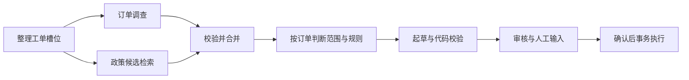

# 第 007 轮：有界并行、预算与取消

本轮把 P06 的审核与持久恢复扩展为 `--workflow parallel`。仍使用离线 ScriptedChatModel，人工批准后执行模拟动作；保留 single / serial / reviewed / durable 入口。

## 1. 从业务依赖划分可并行任务

首先看原 `search_policies`：它内部读取订单、校验归属并过滤商品范围，依赖订单事实。因此新增独立候选检索，只接收工单类型，业务时间来自可信 ToolContext。候选可提前读，但候选存在不代表订单符合政策。

实际主图见 [p07-parallel.mmd](../graphs/p07-parallel.mmd)：



读代码顺序：`workflows/parallel.py` → `workflows/reviewed.py:build_review_graph` → `tools/service.py`。理解 P07 parallel_plan 与 P04 intake 槽位 DTO 的职责。候选专员有自己的输出 PolicyCandidates，其中 applicability 必须为 not_evaluated。

## 2. 合并时保留事实与冲突

分支只写 `task_results` 与 `evidence_join`，二者用 Annotated reducer。join 才更新主图 route / order_findings / policy_candidates。主图 node_trace 记录顺序节点，分支顺序看 events；不能让两个分支各自覆盖完整 node_trace。

`merge_results` 不用“最后写入者获胜”：相同结果去重，同 task 的不同内容并存并记录冲突。`merge_evidence` 对同来源/ID/观察时间下的版本与内容冲突作显式记录。订单不可访问时仍不能读其他订单；候选政策不会带来订单权限。

`branch_results` 在 checkpoint 前提交完成结果与证据。实际退出测试曾显示 join 前的异步 checkpoint 空隙可能导致一个已完成分支重新调度；增加应用结果账本后，重调度使用 branch_replayed，不再重新调用专员。

## 3. 调用前预留，而不是调用后才计数

阅读 `repositories/budgets.py` 与 `agents/bounded.py`：

1. BEGIN IMMEDIATE 检查取消、活动时间、调用数及 token 预留额度。
2. 写入唯一 attempt，提交后才等待统一并发 semaphore。
3. 获许可再次检查取消/活动时间，记录 model_started 或 tool_started。
4. 成功或失败都对账，记录固定 attempt_id；unknown usage 保留预留。
5. 仅可信暂时错误有限退避，下一次 attempt 重新预留。

模型和工具都共用同一并发上限，预算则各有模型/工具次数。validator 和 executor 也消耗工具额度，schema 修复与审核返工后的模型调用仍计数。默认值见 `.env.example`；创建时把限制存入 workflow_runtime，恢复不能通过修改环境增大限制。

schema 修复计数和审核返工预留也在 run_budget。SQL 账本是累计额度来源，graph repair_count 是最后已完成更新，两者在崩溃窗口可能不同。旧 checkpoint 不能获得新的返工额度。

## 4. unknown 不能写成零费用

观察 report.statistics：

| 字段 | 含义 |
|---|---|
| model_calls / tool_calls | 账本中已预留的次数，包含失败及尚未完成的 attempt |
| reservations | attempt 的角色、状态、预留、实际 token、耗时 |
| token_budget_charged | 已知实际 token + 未知 attempt 的保留额度 |
| actual_total_tokens | 有任何模型 attempt 用量未知时为 null |
| known_total_tokens | 仅已报告部分的 subtotal |
| unknown_usage_calls | usage 未报告的模型 attempt 数 |
| monetary_cost / price_state | null / unknown，本轮没有真实 provider 价格 |
| active_elapsed_ms | 累计活动 segment 时间，正常 pause 不计等待 |
| peak_in_flight | 根据持久事件计算的前台调用峰值 |
| roles | 直接按账本 role 汇总，避免并发时全局计数差重复统计 |

全局 token 预留限制不是真实模型生成 token 的强上限；后续接入真实模型还要控制输出 token 并明确输入估算。若 provider 实际报告大于预留，照实记录并阻止后续调用。脚本模型没有 usage，报告保留 unknown。

## 5. 错误、活动 deadline 与停止

429 / 502 / 503 / 504、TimeoutError、ConnectionError 可以有限重试；403/401、政策拒绝、未知程序异常不能按暂时失败重试。只读工具仅 TOOL_TIMEOUT / TOOL_BUSY 自动重试。QUERY_FAILED 可能包含程序问题，因此保留错误而不盲目重试。schema 错误走自己的有限修复通道。

正常人工暂停会关闭活动 segment；恢复继续使用累计活动时间。执行中崩溃没有可靠结束时刻，因此保守计入至恢复，可能包含停机时间。异步调用使用剩余活动预算作为 deadline；同步事务采用有限数据库等待及安全边界检查，不强杀已提交动作。

## 6. 取消的业务语义

```bash
uv run --locked after-sales seed --dataset demo
uv run --locked after-sales run --ticket T-NOTRECEIVED-002 \
  --architecture multi --workflow parallel --model scripted --run-id learning-007 --json
uv run --locked after-sales resume --run learning-007 --json
uv run --locked after-sales cancel --run learning-007 --json
uv run --locked after-sales resume --run learning-007 --json
```

cancel 只请求信号。new_request 表示本次是否新写入，cancel_requested 表示信号状态，acknowledged 表示运行已应用；暂停 run 要 resume 后变为 cancelled。想体验批准执行时，使用另一新 run ID，并在 resume 的交互输入中选择 approve。输出文件不能覆盖既有报告。

取消顺序由业务写锁裁定。取消先提交，新动作事务拒绝执行；退款先提交，取消后仍保留 ActionReceipt 和 refunded_cents，工单可以 resolved，run 为 cancelled。取消不是退款撤销。已 completed 的运行收到取消请求是无效果操作。

本地 demo 身份沿用 P06，HTTP 身份/权限留给 P08。日常 `var/business.sqlite` 不用于自动测试；测试和演示都使用临时数据库。固定业务时钟只存在测试/演示注入，CLI 使用实际 UTC，因此退货 fixture 的窗口会随日期失效。

## 7. 怎么验证这一轮

格式/lint 与 tests 顺序执行，失败时先修复再进入下一道检查：

```bash
uv run --locked ruff format --check .
uv run --locked ruff check .
uv run --locked pytest
uv run --locked python scripts/demo_p07.py
uv build --wheel
```

- `test_parallel_workflow.py`：真实工具 barrier、事实依赖、完整退款恢复、候选无订单读取、分支失败保留成功结果、schema 修复、冲突停止。
- `test_parallel_reducers.py`：重复去重、交换/结合性质、不同版本与相同版本内容冲突。
- `test_parallel_budgets.py`：共享并发槽、两线程最后额度竞争、未知/部分 usage、超出预留、暂时重试与不可重试错误、旧 runtime 不能返还额度、活动 deadline、审核返工预留。
- `test_parallel_recovery.py`：独立 Python 进程在预留/join/业务提交窗口 os._exit、缓存分支、外部取消、pause 时间、保存限制、v2→v3 后旧 P06 待办恢复。
- `test_parallel_cancel.py`：queued/paused/running 取消、事务内阻止新写、提交后保留回执及余额、completed 无效果。
- `test_parallel_cli.py`：自动选 P06/P07 恢复、报告回看、取消、输入限制、既有文件拒绝、未知用量/费用不能篡改成零。

恢复测试还暴露了 Agent 记录在退出时未补全统计的问题；角色统计改为从账本读取，并容忍未完成诊断记录缺少计数。启动 checkpoint 尚未齐备的 running 状态按 interrupted 恢复，不对外当作最终报告。

## 8. 教学观测与交付

同一退款 case 的串行/并行、无延迟/500 ms 注入延迟数据见 [p07-demo-traces.json](../graphs/p07-demo-traces.json)。两个方案都只到人工批准暂停，再单独展示 P07 reopen / approve / completed 取消无效果。真实时间单独记录；这是每种 variant 的一次本机观测，不能代表 provider 性能或稳定加速比。

本轮的边界与权衡详见 [ADR 007](../decisions/007-parallel-joins-and-durable-budgets.md)。本地与远端验收记录如下。


本地验收：488 passed（在 P06 的 429 项基础上新增 59 项），格式/lint 通过。教学观测：无注入延迟串行 227.100 ms、并行 424.178 ms；两条独立读取各注入 500 ms 后串行 1273.111 ms、并行 958.988 ms。观测 JSON 记录完整时间线、累计预算、reopen / approve / completed 取消无效果；这是单次本机观测。


安装包验收：wheel 包含 41 个 Python 模块和 demo JSON，无缓存、测试、业务数据库；在隔离安装环境、项目外目录验证 doctor / seed / inspect / single / serial / reviewed / durable，以及 P07 pause / 跨进程 resume / approve / 重放 / report / cancel 通过。新退款 case 累计 16 次模型、12 次工具调用。

GitHub 交付：实现提交 `f5f299181b69d66b6ae3cc3996e562a939083be2` 已推送，[CI 37051776146](https://github.com/weiwei-cup/after-sales-multi-agent/actions/runs/37051776146) completed/success；Linux 完整回归、旧入口、P07 跨进程批准/回看/取消及 wheel 构建通过。阶段标签 [phase-p07](https://github.com/weiwei-cup/after-sales-multi-agent/tree/phase-p07) 指向最终文档提交，P00～P06 与复核标签保留历史位置。
