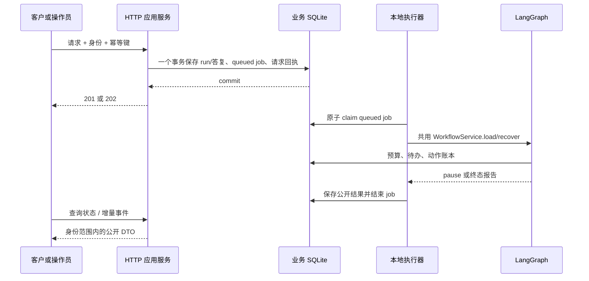

# 第 008 轮：HTTP 应用服务

日期：2026-10-07。对应 P08；继续使用离线 ScriptedChatModel。

本轮把 P07 的持久工作流接到 HTTP：请求负责校验和保存执行意图，后台负责运行，查询负责展示公开状态。LangGraph 仍负责 Agent 分工、审核及 interrupt；FastAPI 不组装模型提示词。

## 这轮实现了什么

| 层 | 文件 | 职责 |
| --- | --- | --- |
| HTTP | `src/after_sales/api/app.py` | lifespan、演示 Bearer 身份、接口、request ID、统一错误 |
| 接口 DTO | `src/after_sales/api/contracts.py` | 创建、启动、待办答复、公开工单/run/事件/回执 |
| 应用服务 | `src/after_sales/services/application.py` | 工单范围、事务 admission、请求幂等、有界线程执行器、启动恢复 |
| 工作流服务 | `src/after_sales/services/workflows.py` | CLI 和 HTTP 执行器共用 durable/parallel 分派与恢复 |
| 对外投影 | `src/after_sales/services/public.py` | 允许返回的字段、常见电话/邮箱/令牌文本脱敏 |
| 业务 schema v4 | `src/after_sales/repositories/migrations.py` | request_idempotency、execution_jobs、api_run_results |

v1–v3 的迁移内容不变；增加 v4，reset 只接受项目已知表。初始 HTTP 登记尚无 checkpoint 的 queued run 可以初始化；已存在 CLI run 丢失 checkpoint 仍保留错误保护。

## 如何启动

在项目根目录执行，使用专门的 P08 模拟库：

```bash
uv sync --locked
export AFTER_SALES_MODEL_MODE=scripted
export AFTER_SALES_BUSINESS_DB_PATH=var/p08-business.sqlite
export AFTER_SALES_CHECKPOINT_DB_PATH=var/p08-checkpoints.sqlite
uv run --locked after-sales seed --json
uv run --locked uvicorn after_sales.api.app:app --host 127.0.0.1 --port 8000 --workers 1
```

打开 `http://127.0.0.1:8000/docs`，OpenAPI 在 `/openapi.json`。Swagger 的 Authorize 输入令牌值；请求使用 `Authorization: Bearer <token>`。

| 演示令牌 | 身份 | 范围 |
| --- | --- | --- |
| `demo-customer-a` | customer / CUST-A | 自己的工单 |
| `demo-customer-b` | customer / CUST-B | 自己的工单 |
| `demo-operator` | operator / OP-DEMO | 演示工单，审批仍受待办绑定约束 |

这些是公开的本地演示凭证。API 的创建/启动/答复/恢复/取消都要求 `Idempotency-Key`，最长 128 字符，使用字母、数字和 `_.:-`。正文不能提供 actor_id、role、customer_id、run_id 或 ticket_id 来冒充身份。

例如启动 CUST-A 的未收到货工单：

```bash
curl http://127.0.0.1:8000/health
curl -X POST http://127.0.0.1:8000/tickets/T-NOTRECEIVED-002/runs \
  -H 'Authorization: Bearer demo-customer-a' \
  -H 'Idempotency-Key: start-refund-1' \
  -H 'Content-Type: application/json' -d '{}'
```

保存返回的 run_id，查询 `/runs/{run_id}`。operator_decision 待办用操作员身份回答：从当前 pending_input 原样带回 pending_id、input_revision、proposal_revision、proposal_hash，以及每个 action_id 对应的 content_hash；decision 选 approve/reject，或通过 revise + refund_amounts 申请金额返工。customer_info 只回答 questions 列出的字段。`can_respond` 帮助界面判断当前身份能否操作。

## 可重复的完整演示

```bash
uv run --locked python scripts/demo_p08.py
```

脚本创建独立临时业务库、在 127.0.0.1 随机端口启动真实 Uvicorn，以 HTTP 完成：health → 创建退货工单 → 启动 → 客户补充 ORD-019 → 操作员批准 → 查询 completed。共 8 条关键请求/状态记录，最终 1 条 waiting_return 回执。

模拟资料的 ORD-019 收货时间为 2026-09-25，演示工厂固定业务时钟为 2026-10-02T04:00:00Z，以保证退货样例可重复。正常 `after_sales.api.app:app` 使用真实 UTC 时间，过期申请应被规则拒绝。记录见 [p08-demo-http.json](../graphs/p08-demo-http.json)。脚本不重置日常库。

## 接口与返回

| 接口 | 成功 | 用法 |
| --- | --- | --- |
| GET /health | 200 | 数据库/执行器就绪，不调用模型 |
| POST /tickets | 201 | customer 创建；type、message、可选 supplied_order_id |
| GET /tickets | 200 | 范围内工单；limit 默认 50、最大 100，offset 非负 |
| GET /tickets/{ticket_id} | 200 | 业务状态、脱敏消息、最新 run |
| POST /tickets/{ticket_id}/runs | 202 | 默认 parallel；可提供 expected_input_revision |
| GET /runs/{run_id} | 200 | queue/running/paused/terminal、待办、精简结果、执行器错误码 |
| GET /runs/{run_id}/events | 200 | after_seq 非负；limit 默认/最大 100 |
| POST /runs/{run_id}/responses | 202 | 带版本/hash 的答复；服务器补齐内部身份 envelope |
| POST /runs/{run_id}/resume | 202 | 正文 `{}`；只恢复 interrupted |
| POST /runs/{run_id}/cancel | 202 | 正文 `{}`；提交信号，轮询运行状态确认投影 |

错误为 `{code,message,request_id}`，同时返回 X-Request-ID。401 是无有效身份；403 是角色不允许；跨客户访问和不存在统一 404；活跃任务/旧待办为 409，同 key 不同规范化 payload 为 IDEMPOTENCY_CONFLICT；无效字段为 422；队列满为 503。错误不回显输入内容。

启动/恢复的回执固定包含 run_id、job_id、accepted。完全相同的 HTTP key 返回已保存回执，即使运行后来完成；同一已消费待办用新 key 提交相同答复返回 accepted、job_id=null，不再建任务。变化的旧答复返回 409。

## 要理解的提交边界



请求幂等保证重试找回同一执行意图；业务 operation key 保证已提交模拟动作不重复。LangGraph checkpoint 和业务数据库不是一个事务，本轮沿用 P06/P07 的输入/动作/调用账本跨越这个窗口。

默认一个后台线程、32 条等待任务，可用 API_WORKERS（1–4）和 API_QUEUE_CAPACITY（1–1000）配置。每个线程运行自己的 asyncio loop；HTTP 同步查询由框架线程池处理。后台模型或同步账本工作不占用 HTTP event loop。每个 run 内的两个并行调用槽仍属于 P07 的独立预算。

同业务库只允许一个 HTTP 服务实例，因此 Uvicorn 固定 `--workers 1`。线程先 claim，再执行；不把无限数量 Future 放进内存线程池。同工单活跃 run 由数据库事务拒绝，同 run/ticket 执行还受文件锁保护。

重启行为：queued 自动执行；HTTP-owned running 改为 interrupted，用户通过 resume 继续；paused 待办保持。startup 不改写独立 CLI-owned 运行。shutdown 停止 claim，等待当前有限任务，剩余 queued 留在库里。不要把多个服务实例或跨机器共享 SQLite 当作已实现能力。

取消为协作式信号。队列满仍接受取消，隐藏待办并阻止后续新动作；空位出现后投影闲置 run。取消投影失败显示 interrupted + execution_error_code，不自动无限循环。完成后的取消保持 completed，已提交金额和回执不逆转。

公开事件只返回 sequence/kind/role/node/tool/elapsed_ms，丢弃内部 payload。next_after_seq 是最后一条返回事件的序号，has_more 控制翻页；无新事件时保留游标。消息文本的电话、邮箱与常见令牌形式做演示级脱敏，内部证据和模型消息不作为 API 响应。

## 验证及修正

运行 `uv run --locked pytest`：**516 passed in 91.29s**，相对 P07 新增 **28 项**。Ruff 格式与静态检查通过，默认 socket guard 保持开启；API 单测通过 ASGI/Unix 通道，强制退出用独立子进程。真实 TCP 演示单独只访问 loopback。

- API 合同：201/202、OpenAPI、健康零调用、身份范围、拒绝正文伪造身份、缺少 key/非法字段、版本与 hash、整数金额。
- 并发与幂等：相同 key 两请求同 run；不同 key 同工单只一活跃 run；两个 worker + 三工单只两条 running，其余 queued；容量不足不留下 run/job/key 的部分提交。
- 恢复：queued admission 后 os._exit、图节点后退出、接受审批后退出、退款提交后退出；已提交退款恢复后仍 1 回执、10000 分，调用预留不增加。
- 取消：queued 零模型调用，paused 自动投影，completed 保留回执，队列满接受信号，投影失败不无限重试。
- 隔离：事件分页无重复、公开字段不透出原始证据/消息/密钥，中文紧邻手机号也脱敏；后台阻塞期间 health 与工单查询能返回。

首轮接口测试定位到图已保存 pending、job 尚在收尾时的 409：public view 现在按 job 状态显示 queued/running，job 结束才显示 pending。客户审批最初先进入内部 envelope schema 得到 422，已先校验角色返回 403。电话正则的 `\w` 包含中文，已改用数字边界，测试覆盖“手机13800138000”。两处旧 doctor 阶段断言从 P07 更新为 P08。

构建 wheel 后在项目外临时目录安装验证：48 个 Python 模块，包含 api/services/demo data，无 tests、缓存、pyc 或业务库；doctor P08、原 CLI、真实 HTTP 退款审批及重放通过。只读核对日常 `var/business.sqlite`：schema 1，ORD-004 refunded_cents=0，T-NOTRECEIVED-002=new。

实现提交 `5a019a3dc6e01acb77e5af2b89f88a35e74e8ee5` 已推送，[CI 37620606885](https://github.com/weiwei-cup/after-sales-multi-agent/actions/runs/37620606885) 为 completed/success，Linux 日志确认 **516 passed in 130.32s**，旧入口、真实 HTTP 8 步演示和 wheel 构建全部通过。阶段快照为 [phase-p08](https://github.com/weiwei-cup/after-sales-multi-agent/tree/phase-p08)，在最终文档提交通过 CI 后建立；P00～P07 与 audit 标签保持原位。下一轮 P09 使用这些公开 DTO 做工单工作台。

## 下一轮前自己检查

能否解释“HTTP 202”和“业务动作完成”的区别？能否找到 HTTP key 和 operation key 各自的表？为什么审批字段必须绑定版本？为什么客户答复提交后退出仍能恢复，而旧确认不能批准新方案？为什么一条运行有并行 Agent，却仍需要限制整个 HTTP 执行器的 worker 数？

相关决策：[ADR 008](../decisions/008-durable-http-admission.md)。框架生命周期参考 [FastAPI lifespan](https://fastapi.tiangolo.com/advanced/events/)，测试接口参考 [FastAPI testing](https://fastapi.tiangolo.com/tutorial/testing/)。
