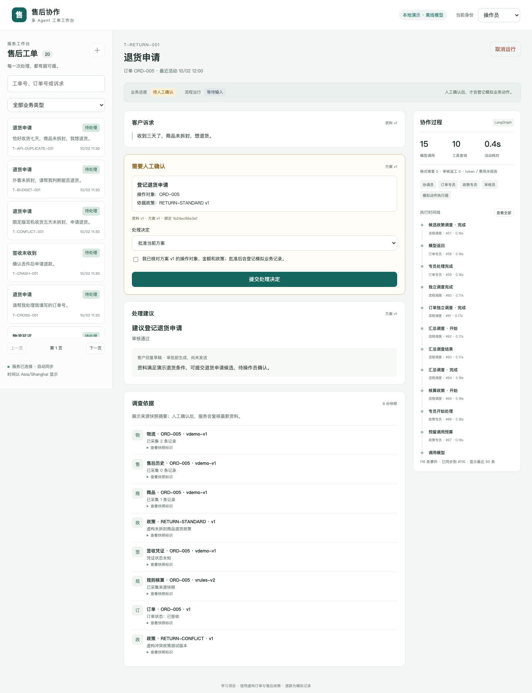
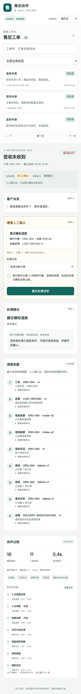

# 第 009 轮：售后工单工作台

日期：2026-10-07。对应 P09；继续使用离线 ScriptedChatModel。P07–P09 的离线 M3 已完成，本地和 GitHub 验收通过。

本轮把已有的持久工作流变成可以操作的页面：客户补充资料，操作员阅读并确认当前方案，页面持续展示调查与审核，服务登记模拟业务动作。

## 这轮实现了什么

| 文件 | 职责 |
| --- | --- |
| `src/after_sales/web/index.html` | 中文工作台、工单列表/详情、人工待办、结果/证据、时间线、新建表单 |
| `src/after_sales/web/workbench.css` | 桌面列表滚动、详情/过程面板、650/1100 像素断点、窄窗口表单 |
| `src/after_sales/web/workbench.js` | 同源请求、身份/选择、轮询游标、过期响应保护、稳定提交键、版本绑定表单 |
| `src/after_sales/api/app.py` | 页面和静态资源分发、CSP、API 0.9.0 |
| `src/after_sales/api/contracts.py`、`services/public.py` | 允许公开的证据/政策/审核/统计摘要；旧公开结果兼容 |
| `scripts/demo_p09.py` | 临时演示库、本地预览、固定历史资料业务时钟 |
| `tests/test_workbench_e2e.py` | 真实 Chromium 的 12 项浏览器验收 |

## 启动页面

在项目根目录执行：

```bash
uv sync --locked
uv run --locked python scripts/demo_p09.py --port 8000
```

打开 [本地工作台](http://127.0.0.1:8000/)。停止进程后，临时演示库会清理；重新启动得到新的演示资料。业务时钟固定在 2026-10-02 12:00 Asia/Shanghai，使历史退货案例可重复。模型为 scripted，不需要密钥。

想保留工单操作记录时，使用独立数据库：

```bash
export AFTER_SALES_MODEL_MODE=scripted
export AFTER_SALES_BUSINESS_DB_PATH=var/p09-business.sqlite
export AFTER_SALES_CHECKPOINT_DB_PATH=var/p09-checkpoints.sqlite
uv run --locked after-sales seed --json
uv run --locked uvicorn after_sales.api.app:app --host 127.0.0.1 --port 8000 --workers 1
```

正常 app 使用真实 UTC 时间，旧退货资料可能已超期；这是规则计算结果。业务库与 checkpoint 文件需一起保存。`/docs`、`/openapi.json` 和 CLI 仍可使用；`/health`、doctor 的当前阶段更新为 P09。

## 三条演示路径

| 场景 | 页面操作 | 最终业务状态 |
| --- | --- | --- |
| 物流延迟 | 客户 B → T-DELAY-002 → 开始处理 → 操作员 → 核对订单 ORD-002/政策/方案 → 勾选确认 → 提交 | 处理中；已登记物流调查 |
| 退货申请 | 客户 B → T-RETURN-001 → 开始处理 → 操作员 → 核对 ORD-005/RETURN-STANDARD v1 → 确认 | 待客户寄回；尚未履约 |
| 签收未收到 | 客户 A → 新建“签收未收到”工单，先不填订单号 → 开始 → 刷新 → 补充 ORD-004 → 操作员核对 ¥100.00/LOST-REFUND v1 → 确认 | 已办结；1 条 10000 分模拟退款记录 |

操作员可看到所有演示工单，创建工单由客户身份完成。人工确认页面可选择批准、拒绝，退款可选择修改金额；修改后重新审核、生成新待办，仍需重新勾选确认。

“运行结束”只表示本轮工作流停止。业务状态来自真实工单与动作回执，因此退货不会显示成已寄回，物流调查也不会显示成已解决。客户回复仍是审批前生成的草稿，页面未发送消息。

## 如何测试

默认离线回归继续禁止 socket 网络：

```bash
uv run --locked ruff check .
uv run --locked ruff format --check .
uv run --locked pytest
```

首次安装浏览器时，将缓存放在项目忽略目录。Linux 可加 `--with-deps` 安装浏览器所需系统库：

```bash
export PLAYWRIGHT_BROWSERS_PATH="$PWD/.tools/playwright-browsers"
uv run --locked playwright install chromium
P09_ARTIFACT_DIR="$PWD/test-results/p09" uv run --locked pytest -m e2e --allow-hosts=127.0.0.1 tests/test_workbench_e2e.py
```

每项 E2E 使用新临时业务库与 checkpoint，不读取 `.env` 或日常库。浏览器测试另外允许 loopback TCP，浏览器路由拒绝外部请求。`P09_ARTIFACT_DIR` 收集截图、summary.json、HTTP 请求结果与 trace.zip；默认输出到测试临时目录。查看 replay：

```bash
uv run --locked playwright show-trace test-results/p09/具体测试目录/trace.zip
```

CI 的 offline-checks 与 browser-checks 分别验收，浏览器观测资料保存 7 天。三条核心路径已归档到 [浏览器记录](../graphs/p09-demo-browser.json)，截图见下方。

## 本地验收记录

- Ruff 格式/lint、JavaScript 语法检查通过。
- 默认回归：最终代码 519 passed in 91.11s，12 项 E2E 单独运行，不在默认套件里。首次完整回归 92.85 秒；阶段标识变更后，首轮 CI 揭示两处跨 CLI 的旧断言，补齐后再次运行完整套件。
- 真实 Chromium 153.0.8010.12，Playwright 1.63.0：12 passed in 37.06s。三类业务分别产生 1 条对应动作回执。
- 最终中文事件标识/阶段标识调整后，三条核心路径与窄窗口再验证：4 passed in 14.20s；公开 API/CLI/契约追加 28 passed in 6.86s。截图和核心轨迹来自最终页面。
- 双击启动/批准：1 个 run、2 个 execution job（启动和审批）、1 条动作。启动回执丢失后刷新、审批回执丢失后重试，浏览器请求键保持一致。
- 事件断线保留非零 after_seq，恢复后从原游标读取，画面事件序号有序且不重复。
- 另一操作员真实 revise 到 9000 分；旧浏览器方案提交真实 HTTP 409，新画面显示 ¥90.00 且确认框未选。重新阅读后批准才登记动作。
- 页面金额 90.001 被拒绝，90.00 进入重新审核，新方案必须再次勾选；最终只登记一次 9000 分。
- 测试服务在 intake 后真实抛错，执行器投影 interrupted；页面恢复到待确认，再取消，不产生业务动作。这项验证页面对既有恢复接口的接入，P08 的独立进程退出测试继续保留。
- 1440×1050 与 390×844：审批对象、金额、政策、版本、确认与时间线可用；窄窗口无水平溢出。人工检查待办截图，并在应用内浏览器实际操作开始处理、身份切换与审批前展示。
- wheel：48 个 Python 模块、3 个页面资源和 demo JSON；不含测试、缓存、数据库或 pyc。项目外隔离安装后，旧 CLI、页面/静态资源、公开证据/政策、HTTP 退款批准与同 key 重放通过。
- 日常库只读确认 schema_migrations 仍为 `[1]`、ORD-004 已退 0、T-NOTRECEIVED-002 为 new；所有执行验证使用独立临时资料。





## 这一轮要理解的概念

1. 页面状态、图运行状态和业务状态有什么区别？为什么 completed 不能代表退货已履约？
2. 202 回执丢失时，为什么要带着原请求键重试？为什么还需要独立的业务动作账本？
3. 为什么轮询不能反复重建正在填写的表单？另一位操作员改方案后，为什么原勾选不能沿用？
4. 为什么公开证据摘要不能直接返回内部 facts 或完整 Agent 消息？
5. 为什么“页面恢复成功”与“进程崩溃后持久恢复成功”需要分别测试？

设计取舍见 [ADR 009](../decisions/009-browser-workbench-and-public-evidence.md)。下一轮 P10 做同条件对照评估和最终交付；真实模型对照仍按用户当前选择暂缓。

## GitHub 交付

首轮实现提交 `e99bd348415bf81176621699da3f7791748017c3` 已推送。[CI 37639269862](https://github.com/weiwei-cup/after-sales-multi-agent/actions/runs/37639269862) 的 browser-checks 成功（12 passed in 57.21s），offline-checks 为 517 passed / 2 failed：阶段标记改为 P09 后，durable/reviewed CLI 的两处 doctor 断言仍期待 P08。已同步预期，保留副作用/能力范围断言，完整本地回归 519 passed in 91.11s；后续 CI 与 phase-p09 将在验证后记录。

学习点：修改共享报告字段后，应搜索所有入口的断言，不能只根据 `test_cli.py` 的文件名判断影响范围。历史阶段标签保持不变。

补修提交 `980242ddd6fd46da6c4e5ff3181d93f6b925797e` 已推送，[CI 37640417752](https://github.com/weiwei-cup/after-sales-multi-agent/actions/runs/37640417752) 为 completed/success，offline-checks 与 browser-checks 均通过。Linux 日志确认 519 passed in 184.39s、12 passed in 61.24s；旧 CLI、P08 真实 HTTP 8 步和 wheel 构建通过。[浏览器观测资料](https://github.com/weiwei-cup/after-sales-multi-agent/actions/runs/37640417752/artifacts/11492385595) 含截图、请求结果和 replay traces，保存 7 天。

阶段快照为 `phase-p09`，在最终文档提交通过 CI 后建立；P00–P08 与复核标签保持原位。继续离线模型与模拟动作；P10 尚未开始。
