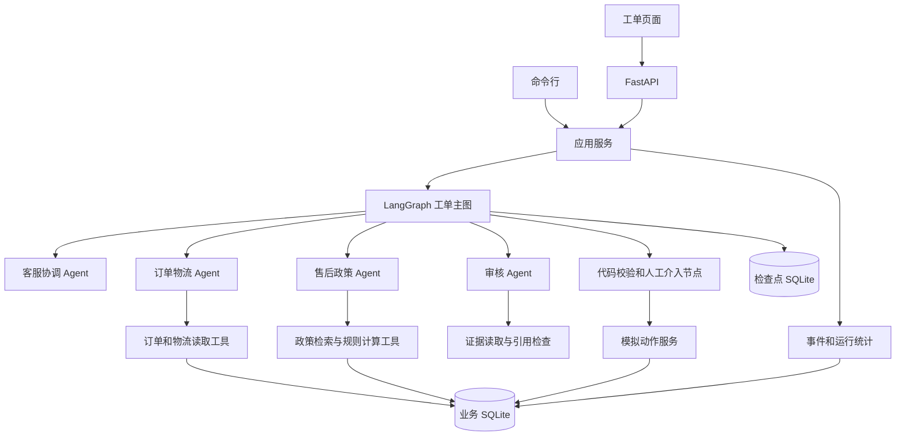
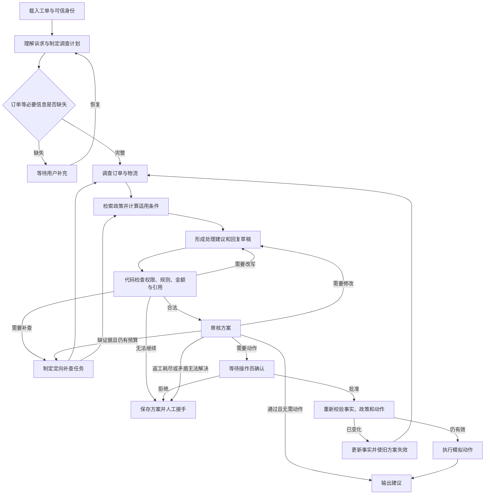

# 售后工单多 Agent 工作台：技术方案

版本：0.2（P00 本地验收通过）

日期：2026-10-02

实施路线：[plan.md](../plan.md)

## 1. 项目目标与范围

通过一个本地可运行的售后系统，学习工具调用、Agent 分工、状态交接、审核返工、人工介入、并行执行和失败恢复。最终交付可演示的应用、可重复执行的测试、评估结果以及架构说明。

首版业务覆盖三类工单：

| 类型 | 示例诉求 | 需要调查的事实 | 预期处理方式 |
| --- | --- | --- | --- |
| 物流延迟 | “预计昨天送到，现在还没收到” | 订单、预计送达时间、物流事件 | 解释进度；必要时提议创建物流调查单 |
| 签收未收到 | “显示签收，但我没有拿到” | 签收事件、凭证、用户陈述、物流调查结果 | 追问或调查；有明确丢件证据时才评估退款 |
| 退货申请 | “收到三天了，商品未拆封，想退货” | 收货时间、商品类别、商品状态、历史售后 | 判断模拟政策适用性，提议登记退货申请 |

这里的售后政策是为学习项目编写的虚构规则，记录版本和生效时间。项目不接入真实支付、快递、客户消息发送服务。第一版输出处理建议和回复草稿；后续阶段增加人工确认后的模拟动作。

首轮暂不建设多租户、生产登录系统、外部消息通道、长期用户画像、向量数据库和分布式任务队列。这些作为后续扩展，避免与学习 Agent 协作争夺实施精力。

### 1.1 最终用户体验

1. 在工单列表选择或创建工单。
2. 启动处理，查看当前 Agent、工具调用和已收集证据。
3. 需要补充信息时填写回答；需要操作员判断时审核具体方案。
4. 查看处理建议、回复草稿、引用、模拟动作结果和执行统计。
5. 关闭程序后重新启动，能够找到等待中的工单并继续处理。

### 1.2 完成标准

- 三类正常场景和关键异常都有固定样例。
- 重要结论关联订单、物流或政策证据；资料不足会产生明确缺口。
- 用户只能访问属于自己的模拟订单；模型不能更改可信身份。
- 审核返工有上限，预算耗尽有明确结束方式。
- 人工确认绑定到具体动作与版本，旧确认不能授权新方案。
- 重复请求和崩溃恢复不会重复产生模拟退款或退货记录。
- 有单 Agent 与多 Agent 的同条件对照报告，结果如实记录。

## 2. 技术选型与职责

| 层次 | 选型 | 用途 |
| --- | --- | --- |
| 运行环境 | Python 3.12，uv | 依赖、虚拟环境和命令入口；P00 校验本机兼容性 |
| 外层编排 | LangGraph `StateGraph` | 显式状态、有限路由、返工、interrupt 和检查点 |
| Agent 循环 | LangChain `create_agent` | 模型调用、工具调用循环和结构化结果 |
| 数据契约 | Pydantic 2 | 校验输入、工具返回、Agent 结果和 API 数据 |
| 业务数据库 | SQLite | 订单、工单、动作账本、事件和运行统计 |
| 执行检查点 | LangGraph SQLite checkpointer | 保存图的运行状态，与业务库分开存储 |
| Web 后端 | FastAPI | 工单、启动处理、补充信息、人工确认和事件接口 |
| 首版界面 | 原生 HTML / CSS / JavaScript | 工单列表、详情、处理过程和审核表单，由后端服务静态资源 |
| 自动化验证 | pytest，HTTPX；界面阶段增加 Playwright | 单元、图集成、HTTP 和浏览器测试 |
| 模型接入 | 一个可配置的 LangChain provider adapter | 初期各角色使用同一模型，之后再比较角色模型配置 |

依赖范围在 `pyproject.toml` 中声明，实际兼容版本由 P00 的 smoke test 验证并锁定到 `uv.lock`，后续升级需要通过回归检查。采用当前 `create_agent` 接口，不以旧教程中的 AgentExecutor 作为新项目入口。[S1]

## 3. 系统架构



### 3.1 调用边界

- `domain` 定义订单、工单、政策、动作和纯业务规则，不依赖 LangChain / LangGraph。
- `repositories` 负责数据访问，不直接调用模型。
- `tools` 为 Agent 包装只读业务能力，输入和输出都经过校验。
- `agents` 定义提示词、允许工具和结构化结果。
- `workflows` 负责角色衔接、上下文裁剪和合法路由。
- `services` 负责启动、恢复、人工输入、模拟动作和运行生命周期。
- CLI 和 HTTP 共同调用 services，避免各自实现一套工单逻辑。

模型输出是候选判断。订单归属、金额、时间边界、动作权限和幂等性由代码检查；任何模型“通过”都不能绕过这些条件。

### 3.2 图节点与 Agent 的区别

图同时包含 Agent 节点和普通代码节点。数据库读取、状态更新、权限验证不需要额外调用模型。审核角色可以先实现为结构化评估节点，后续再增加证据读取工具；避免为了凑角色数量创建无实际职责的 Agent。

第一版采用受约束的协调模式：客服协调 Agent 提出调查计划，外层主图执行允许的路径。后续仍保留明确终止规则，不允许模型生成任意节点名、任意 SQL 或任意工具。

## 4. Agent 设计

| 角色 | 接收的上下文 | 允许工具 | 输出契约 | 可决定的事情 |
| --- | --- | --- | --- | --- |
| 客服协调 | 用户诉求、已知槽位、各专员结果、审核意见 | 初期通过图委派专员；不暴露写工具 | `IntakeResult`、`InvestigationPlan`、`ResolutionProposal` | 业务分类、所需调查、追问、回复草稿 |
| 订单物流 | 一个工单对应的可信客户范围、订单 ID、调查问题 | `get_order`、`get_tracking`、`get_delivery_proof`、`get_after_sales_history` | `OrderInvestigation` | 查询顺序、是否需要更多订单证据 |
| 售后政策 | 意图、订单事实、商品条件、有效政策目录 | `search_policies`、`get_policy`、`evaluate_policy` | `PolicyAssessment` | 查哪些政策、哪些条件仍缺失 |
| 审核 | 候选方案、规则检查结果、可见证据和审核标准 | `get_evidence`、`validate_evidence_refs` | `ReviewResult` | 接受、要求补查、要求修改或建议人工接手 |

同一模型可承担不同角色。每个专员使用自己的 messages 和工具集，结束后仅返回结构化摘要与引用，不把完整内部对话复制给所有角色。[S2]

提示词文件需要包含：职责、输入解释、工具用途、完成标准、输出 schema、缺失信息处理、引用要求和行动边界。提示词、schema、政策都记录版本，便于复现。

## 5. 工单主流程



图中的分叉表达允许的补查目标；单次补查只调用被列入任务的专员。并行阶段先让订单调查和“政策候选检索”并行，合并订单事实后再计算政策适用性，保留依赖关系。

### 5.1 两组状态

工单业务状态与运行状态分别记录：

| 业务状态 | 意义 |
| --- | --- |
| `new` | 尚未开始 |
| `processing` | 正在处理 |
| `waiting_customer` | 等待用户资料 |
| `waiting_review` | 等待操作员决策 |
| `waiting_return` | 退货申请已登记，等待后续履约 |
| `resolved` | 信息答复或模拟退款等已完成当前业务目标 |
| `handed_off` | 交给人工处理，保留证据和建议 |

运行状态：`queued`、`running`、`paused`、`completed`、`failed`、`interrupted`、`cancelled`。

图结束不代表售后业务完成。例如登记退货申请后，本轮 run 可以 `completed`，工单应为 `waiting_return`。返工和工具错误不能把工单误标为 `resolved`。

### 5.2 初始限制

- 最大返工次数：2 次；审核和代码校验触发的补查、改写共享这一计数，避免校验循环绕过上限。
- 一次补充用户输入产生新的 `input_revision`，已被回答的缺口不再追问。
- 有效政策冲突、关键证据矛盾、预算耗尽时保存现有结果并人工接手。
- 未知意图转人工；无法访问订单时不继续查询其物流或其他资料。

## 6. 数据与状态契约

### 6.1 核心业务模型

| 模型 | 关键字段 |
| --- | --- |
| `Ticket` | id、customer_id、order_id、type、messages、status、input_revision、version |
| `Order` | id、customer_id、items、paid_cents、refunded_cents、status、received_at、version |
| `TrackingEvent` | order_id、event_type、occurred_at、source、version |
| `DeliveryProof` | order_id、proof_status、source、version；缺失凭证是独立状态 |
| `Policy` | id、version、effective_from/to、scope、conditions、allowed_actions、clauses |
| `Evidence` | id、source_type、source_id、source_version、observed_at、facts、excerpt |
| `ActionProposal` | action_id、type、order_id、amount_cents、reason、evidence_ids、policy_refs、proposal_revision |
| `PendingInput` | id、run_id、kind、requested_fields/action_id、revision、resolved_at |

金额统一为整数分；时间存储为带时区 UTC，页面按 Asia/Shanghai 显示。业务规则接收注入的 `as_of_time`，测试不依赖机器当前时间。

用户陈述、物流系统事件、政策条款分别标注来源，不能把“用户说未收到”转换成“物流已确认丢失”。证据 ID、版本和来源由程序生成。

### 6.2 Agent 结果模型

- `IntakeResult`：intent、order_id 候选、slots、missing_fields。
- `InvestigationPlan`：任务 ID、owner、目标、所需证据、依赖任务。
- `OrderInvestigation`：verified_facts、user_claims、evidence_ids、gaps、tool_errors。
- `PolicyAssessment`：policy_refs、条件计算结果、allowed_actions、missing_facts、conflicts。
- `ResolutionProposal`：decision_code、claims、evidence_refs、customer_reply_draft、actions、unresolved_questions。
- `ReviewResult`：outcome、issues、targeted_tasks、revision_instructions。

路由只接受枚举：`accept`、`research_more`、`revise`、`human_review`、`handoff`。非法结构最多修复一次，仍失败则结束为可诊断的失败或人工接手，不做无限 JSON 重试。[S3]

### 6.3 图状态

外层 `TicketState` 使用 `TypedDict`；节点输入/输出在边界通过 Pydantic 校验后转为可序列化字典。`create_agent` 的专员状态保留其要求的消息 schema，不直接复用业务 Pydantic 模型作为 Agent state。[S4]

图状态包含：

```text
schema_version, ticket_id, run_id, thread_id
input_revision, proposal_revision, as_of_time
intent, slots, investigation_tasks
order_findings, policy_candidates, policy_assessment
evidence_by_id, proposal, validation_result, review_result
pending_input_id, revision_count, budget_snapshot
errors, final_result
```

运行时依赖对象、数据库连接和模型密钥放入 runtime context，不写入图状态。身份范围从应用服务注入，模型不能指定客户身份。

并行 worker 仅返回本任务结果。证据按 ID 合并；同 ID 同内容去重，同 ID 不同内容产生冲突；任务按 task_id 和 revision 归并。由单个汇总节点生成最终 proposal，避免并行覆盖标量字段。

## 7. 工具与业务规则

### 7.1 工具契约

| 工具 | 业务用途 | 重要检查 |
| --- | --- | --- |
| `get_order(order_id)` | 获取允许访问的订单 | 可信 customer_id 范围、只返回必要字段 |
| `get_tracking(order_id)` | 获取物流事件 | 与工单订单范围一致，保留事件时间 |
| `get_delivery_proof(order_id)` | 获取签收凭证状态 | 区分凭证缺失、未查询成功、凭证存在 |
| `get_after_sales_history(order_id)` | 查重复售后和已退款情况 | 归属与金额事实 |
| `search_policies(intent, product_type)` | 按明确标签检索政策候选 | 只检索版本化政策目录；首版无向量检索 |
| `get_policy(policy_id, version)` | 读取条款和条件 | 来源可追溯；不存在的 ID 明确报错 |
| `evaluate_policy(policy_ref, fact_refs)` | 用可信事实计算适用性 | 模型只传引用，程序从事实存储读取值 |
| `get_evidence(evidence_id)` | 审核证据 | 只能读取当前工单范围内证据 |
| `validate_evidence_refs(refs)` | 检查引用存在和版本匹配 | 引用结构有效不代表语义必然正确，仍需审核 |

统一返回：`ok`、`data`、`evidence_ids`、`error_code`、`retryable`。超时、没有结果和业务拒绝使用不同错误码。工具结果中的外部文本作为资料处理，不能成为系统指令。

### 7.2 虚构政策与确定性规则

- 退货窗口：`request_time <= received_at + 7 * 24h`，恰好边界可申请；缺失收货时间则结果为 unknown。
- 指定模拟商品类别且未拆封才满足示例无理由退货条件；不满足返回具体条件失败。
- “签收未收到”须先调查；只有模拟物流调查明确确认丢件，才进入退款资格评估。
- 退款金额必须大于 0，且不超过 `paid_cents - refunded_cents`，由代码计算上限。
- 已有有效退货申请时返回已有记录，避免重复登记。
- 存在多份同时有效但互相冲突的政策时返回人工接手，不由模型随意选择。

条件结果使用 `true / false / unknown`，未知不能按 false 自动拒绝，也不能按 true 自动批准。政策判断携带版本和事实引用，供执行前再次校验。

### 7.3 写操作

`open_logistics_case`、`create_return_request`、`issue_mock_refund` 由动作服务执行。第一版不暴露给专员的工具集；通过图中的确定性执行节点调用。上述模拟写动作均在展示具体方案后由演示操作员确认，客户补充回答不等同于操作员确认。

## 8. 人工介入、持久化与幂等

### 8.1 暂停与恢复

缺资料和确认动作采用不同 `PendingInput.kind`。暂停载荷包括 pending ID、问题或动作明细、输入版本和方案版本。应用服务校验响应者角色、pending ID、版本及是否已处理，再调用 `Command(resume=...)`。

每个 run 有唯一且稳定的 `thread_id`；暂停恢复继续同一 thread，主动重新调查创建新 run。预算在恢复后累计，等待用户的时间不计入活动执行时长。[S5]

`interrupt()` 恢复会从所在节点开头重新执行，因此：

- 人工等待节点只负责构造载荷和接收决定；写动作放到后续执行节点。
- 暂停前创建 pending 记录也必须有稳定 ID 和唯一约束。
- 修改动作参数产生新方案版本，重新校验并再次展示；旧批准不沿用。
- 新政策或订单版本变化导致旧方案失效，重新调查或再次确认。[S6]

### 8.2 数据库职责

`business.sqlite`：customers、orders、order_items、tracking_events、delivery_proofs、policies、tickets、ticket_messages、runs、pending_inputs、action_ledger、refunds、return_requests、logistics_cases、run_events、request_idempotency、schema_migrations。

`checkpoints.sqlite`：由框架管理图检查点，不手工修改内部表。两库分别持久化，不能假设业务提交和图检查点能原子提交。

业务库启用外键、合适的 busy timeout 和明确事务。演示服务只运行一个进程；同工单同一时刻允许一个活跃执行器。用数据库条件更新占用 run，避免两个 HTTP 请求同时启动；内存锁只作辅助。

### 8.3 动作幂等

1. 应用程序为逻辑动作生成稳定 `action_id / operation_key`，并保存 payload hash。
2. 已存在同 key、同 payload 的成功结果，返回原结果；同 key 不同 payload 返回冲突。
3. 首次执行再次检查身份、批准版本、最新订单与政策、退款余额或已有申请；时间条件用执行时的注入时钟重新计算，原 `as_of_time` 只保留为历史决策依据。
4. 在同一个业务数据库事务中写动作账本、模拟业务记录、金额更新和动作事件。
5. 图检查点稍后保存；若此间崩溃，恢复时查动作账本获得已有结果。

模拟系统借助同库事务和唯一约束保证同一动作只产生一次业务变更。未来接真实外部服务时，需要对方幂等键或查询对账机制；本地检查点本身不能保证外部副作用只执行一次。

### 8.4 启动恢复与取消

- 重新启动加载 queued run；原 running run 标记为 interrupted，提供恢复入口。
- paused run 显示对应待办，可补充信息或确认继续。
- 已经完成的动作以账本为准，不因旧图状态再次执行。
- schema / workflow 版本不兼容时保留数据并报告版本冲突，先做明确迁移。
- 取消在节点边界生效；已经提交的模拟动作保留真实状态，取消不表示撤销。

## 9. 错误、预算和可观察性

### 9.1 初始可配置预算

| 限制 | 初始值 | 处理方式 |
| --- | --- | --- |
| 同 run 模型调用 | 20 次，包含重试和结构化修复 | 调用前占用预算，耗尽转人工 |
| 同 run 工具调用 | 30 次，包含重试 | 记录停止原因 |
| 审核返工 | 2 次 | 保存最后建议和未解决问题 |
| 并发专员 | 2 个 | 限制模型并发 |
| 单模型请求超时 | 30 秒 | 仅暂时性错误有限重试 |
| 单工具调用超时 | 5 秒 | 标记资料未取得，不能伪造空结果 |
| 活动执行时长 | 120 秒 | 在可安全停止的边界终止 |
| 单 Agent 输入 | 估算最多 6,000 token | 保留必要事实、摘要和引用 |
| 单次输出 | 最多 1,200 token，按 provider 能力配置 | 避免无界输出 |
| 全 run token 预算 | 初始 50,000，按实际 provider 校准 | 使用估算预留和实际 usage 对账 |

这些是初始工程参数，不是已经验证的性能承诺。模型和工具调用次数是硬上限；token 预算采用估算预留和 usage 对账，存在误差，属于软上限，不能宣称严格限制实际计费 token。无法获得实际 token usage 时标记 unknown / estimated，不能填 0。费用基于用户配置的价格快照计算，无价格配置则不显示货币估算。

并发预算由统一控制器原子预留，恢复时从调用账本校正累计值。`recursion_limit` 作为兜底，不能代替业务预算。provider 的隐式重试需要关闭或纳入明确记录。

### 9.2 错误分类

- 暂时性错误：超时、限流、服务暂不可用；允许有限退避重试，默认最多额外 2 次并受全局预算约束。
- 输入错误：缺订单号或资料，等待用户补充。
- 业务错误：无权访问、规则不满足、订单状态不允许；不重试相同请求。
- 模型结果错误：schema 无效、未知路由、无效证据引用；有限修复或人工接手。
- 程序错误：保留失败 run 和错误位置，禁止伪装业务成功。

### 9.3 事件

统一记录：run/ticket ID、序号、Agent、节点、task ID、revision、event_type、简短决策依据、工具名称、结果摘要、耗时、usage、error_code 和版本信息。

事件覆盖 run_started、node_started/completed、model_called、tool_called、evidence_added、review_finished、input_requested、input_received、action_committed、run_finished/failed。

早期就加入最小事件记录，后续再展示时间线。前端只接收经过筛选的事件 DTO；不直接透出整个图状态、模型密钥、完整联系方式或内部消息。决策依据记录可读摘要，不要求保存模型隐藏推理。

## 10. API 与界面

### 10.1 API 草案

| 方法与路径 | 行为 |
| --- | --- |
| `GET /health` | 进程和数据库检查，不调用付费模型 |
| `GET /tickets` | 查询当前演示身份范围内工单 |
| `POST /tickets` | 创建工单，返回 201 |
| `GET /tickets/{ticket_id}` | 工单详情、业务状态、最新 run 和待办 |
| `POST /tickets/{ticket_id}/runs` | 创建 queued run，返回 202；要求 Idempotency-Key |
| `GET /runs/{run_id}` | run 状态和结果 |
| `GET /runs/{run_id}/events?after_seq=N` | 有序增量事件，首版前端轮询 |
| `POST /runs/{run_id}/responses` | 回答 pending input，校验 ID 和版本后恢复；要求 Idempotency-Key |
| `POST /runs/{run_id}/resume` | 恢复 interrupted run；与 paused 回答分开 |
| `POST /runs/{run_id}/cancel` | 设置取消请求，返回当前状态 |

启动和恢复由应用级执行器处理，HTTP 请求不等待完整模型流程。首版为单进程、有上限的本地执行器；queued 状态先写入数据库，恢复行为见 8.4。

错误响应统一包含 code、message、request_id。无权访问和不存在对客户统一为不可访问；活跃 run 冲突、过期确认、同幂等键不同载荷返回 409；schema 无效返回 422。

本地演示使用固定 customer / operator 身份，通过独立演示配置注入。不能把模型输出或请求正文中的 customer_id 当作身份来源。生产鉴权是后续独立阶段。

### 10.2 界面范围

- 工单列表：类型、业务状态、最后更新时间。
- 工单详情：用户诉求、脱敏订单事实、证据、建议和回复草稿。
- 执行面板：当前角色、工具事件、审核返工、调用与耗时统计。
- 待办区域：用户补充表单、操作员确认表单，显示方案版本。
- 运行操作：开始、恢复、取消；重复点击使用同一请求键。

演示页面可切换预设身份，界面说明这是本地演示。首版用事件轮询；需要降低延迟时再增加 SSE。

## 11. 测试与评估

### 11.1 测试分层

| 层级 | 验证内容 | 模型方式 |
| --- | --- | --- |
| 单元 | 金额、时间、三值条件、引用、合并、身份范围 | 无模型 |
| 工具集成 | 真实临时 SQLite、只读工具、错误分类 | 无模型 |
| Agent 契约 | 实际工具调用循环、schema 修复和预算计数 | ScriptedChatModel |
| 图集成 | 路由、返工、暂停恢复、上下文隔离 | ScriptedChatModel |
| 恢复集成 | 新进程恢复、崩溃窗口、动作幂等 | 脚本模型＋故障注入 |
| API / E2E | HTTP 行为、重复请求、页面待办和事件 | 脚本模型 |
| live smoke / eval | provider 兼容性、语义质量和协作收益 | 显式开启的真实模型 |

`ScriptedChatModel` 实现兼容 LangChain 的消息、工具调用 ID 和结构化返回；脚本描述模型行为，预期业务结果在独立 fixture 中人工编写。集成测试运行真实图和真实工具，不直接 mock 掉整张图。[S7]

离线测试默认禁止网络并使用临时数据库。live 测试需要显式开关和模型配置；没有凭据时明确 skipped。低 temperature 不能保证确定性，不以回复全文或真实模型固定工具顺序作为断言。

### 11.2 样例集

准备 30 个版本化案例，20 个开发案例、10 个留出案例。三类正常工单，加上缺信息、政策矛盾、不可访问订单、工具异常、无效引用、过期确认、重复提交和恢复案例。评估 gold 记录合法结果集合、必要证据、禁止动作和允许待办，不强制唯一自然语言答案。

真实模型评估先输出结果，暂不因小样本波动阻塞早期阶段；P10 再按目标验收：

- 越权读取、未确认写动作、重复写动作、超额退款：0 次，属于必须通过项。
- 正常案例处理结果与 gold 的一致率目标至少 90%；报告样本数和重复次数。
- 程序验证引用存在性；人工抽查语义支持程度、政策正确性和表达质量。
- 记录工具 / 模型调用、已知或估算 token、活动时长、等待时长和费用配置版本。
- 单 Agent 和多 Agent 使用同一资料、工具服务、模型、预算、规则与确认门槛，各跑同一案例至少 3 次；分别比较质量、耗时和成本，不预设多 Agent 胜出。

## 12. 建议目录

```text
.
├── README.md
├── plan.md
├── pyproject.toml                 # P00 创建
├── uv.lock
├── .env.example
├── docs/
│   ├── technical-design.md
│   └── decisions/                 # 重要设计变更记录
├── src/after_sales/
│   ├── domain/                    # models / policy_rules / enums
│   ├── repositories/              # sqlite / migrations / seed
│   ├── tools/                     # orders / logistics / policies / evidence
│   ├── models/                    # factory / scripted / capabilities
│   ├── agents/                    # coordinator / order / policy / reviewer
│   ├── prompts/                   # 版本化角色提示词
│   ├── workflows/                 # state / graph / nodes / reducers
│   ├── services/                  # tickets / runs / actions / approvals
│   ├── runtime/                   # budgets / events / executor / clock
│   ├── api/                       # app / routes / DTOs / demo_identity
│   ├── web/                       # HTML / CSS / JS
│   └── cli.py
├── fixtures/                      # 模拟数据和开发案例
├── evals/                         # runner / gold / holdout / reports
├── tests/                         # unit / integration / recovery / api / e2e / live
└── var/                           # 本地数据库和输出，忽略提交
```

目录按阶段创建，暂不生成空目录或预写所有框架。当前路径拼写 `muti-agent` 保留，Python 包名采用 `after_sales`。

## 13. 已确定与待确定事项

已确定：售后工单场景、LangGraph＋LangChain、先本地模拟、四种职责、规则与动作由代码兜底、分阶段实施。

默认设计：Python 3.12、uv、SQLite、FastAPI＋原生页面、中文业务交互。若后续偏好变化，在进入相关阶段前调整设计和 plan。

待 P03 的 live 接入前确定：模型服务商、模型标识、凭据提供方式和实际请求预算。离线阶段可以独立完成，不需要提前选择或购买服务。

## 14. 官方资料与设计依据

框架行为按 2026-10-02 查阅的官方资料核对。下面支持框架能力说明，具体业务规则和工程参数是本项目的设计选择。

- [S1 LangChain Agents / create_agent](https://docs.langchain.com/oss/python/langchain/agents)
- [S2 LangChain Subagents：上下文和职责隔离](https://docs.langchain.com/oss/python/langchain/multi-agent/subagents)
- [S3 LangChain Structured output](https://docs.langchain.com/oss/python/langchain/structured-output)
- [S4 LangGraph Graph API：State、Nodes、Edges 和 reducers](https://docs.langchain.com/oss/python/langgraph/graph-api)
- [S5 LangGraph Persistence](https://docs.langchain.com/oss/python/langgraph/persistence)
- [S6 LangGraph Interrupts：恢复与节点重执行](https://docs.langchain.com/oss/python/langgraph/interrupts)
- [S7 LangChain Test](https://docs.langchain.com/oss/python/langchain/test)
- [LangGraph Subgraphs](https://docs.langchain.com/oss/python/langgraph/use-subgraphs)
- [LangChain Tools](https://docs.langchain.com/oss/python/langchain/tools)
- [LangChain Models](https://docs.langchain.com/oss/python/langchain/models)
- [FastAPI Testing](https://fastapi.tiangolo.com/tutorial/testing/)
- [pytest markers](https://docs.pytest.org/en/stable/how-to/mark.html)
