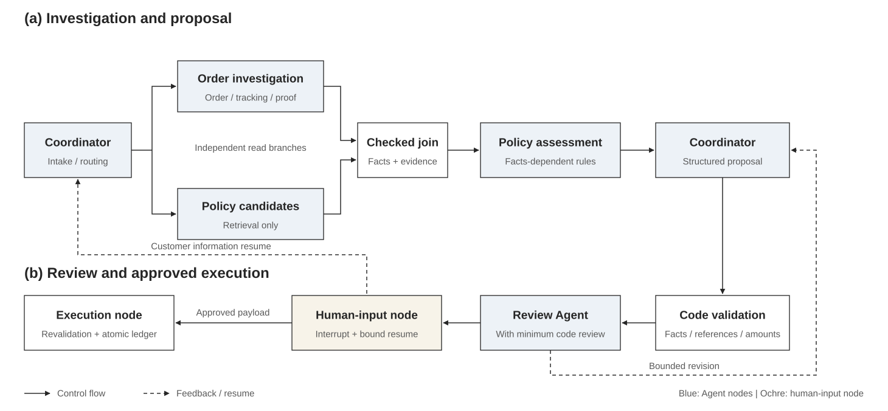
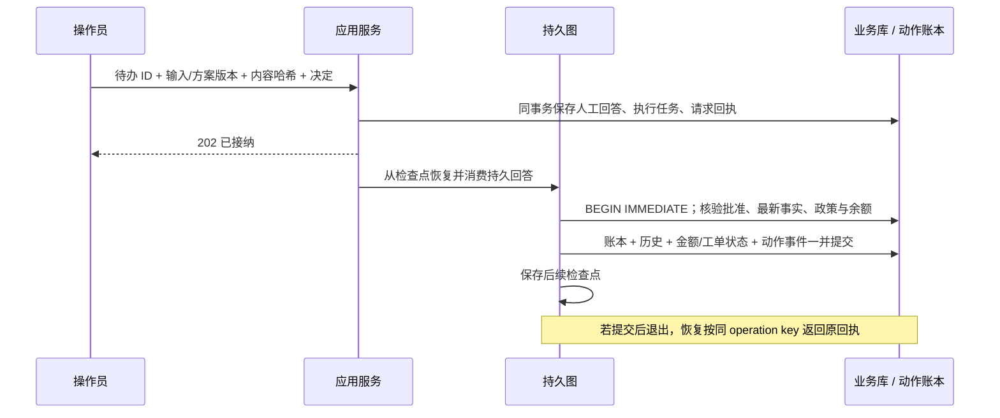

# 系统架构

本文描述当前实现。操作入口见 [演示指南](demo.md)，HTTP 字段以 [OpenAPI 与接口契约](api.md) 为准。

## 业务边界

系统处理物流延迟、签收未收到与退货申请。客户陈述进入工单；订单、商品、物流、凭证、历史售后和政策来自可信工具。建议经过事实校验、政策复算与审核；必要资料由客户补充，涉及业务写入的动作由操作员确认。

业务数据与政策均为版本化模拟资料，执行器登记物流调查、退货申请和模拟退款。回复是草稿，未对外发送；业务状态由实际记录决定，例如退货登记后为 `waiting_return`，图完成不意味着退货履约完成。

## 技术栈与分层

| 层 | 组件 | 职责 |
| --- | --- | --- |
| 展示 | 原生 HTML/CSS/JavaScript | 工单、待办、证据、回执和轮询时间线 |
| 接口 | FastAPI、Pydantic | 身份注入、DTO 校验、状态码、请求 ID |
| 应用 | ApplicationService、WorkflowService | 持久请求接纳、队列、执行和图版本分派 |
| 编排 | LangGraph、AsyncSqliteSaver | 状态、条件路由、并行汇合、interrupt / Command 恢复 |
| Agent | LangChain `create_agent`、ScriptedChatModel | 真实工具调用循环、角色上下文、结构化交接 |
| 业务 | 只读工具、证据存储、确定性规则 | 可信事实、来源引用、政策资格与执行复核 |
| 数据 | SQLite、POSIX 文件锁 | 事务、幂等、预算与进程所有权 |
| 验证 | pytest、Playwright、独立评估器 | 规则/契约、并发/崩溃、HTTP/浏览器与业务评分 |

脚本模型根据实际 ToolMessage 生成后续调用和方案，不读取预期答案。它提供无需密钥的可重复执行模式；不能用于证明自然语言意图识别或真实模型的推理质量。

## 多 Agent 处理图

图示展示主要业务动作路径，省略异常转人工、无动作终止和部分恢复分支；人工输入由 API 持久化后恢复图执行。具体节点、路由与 reducer 见 [实现图](graphs/p07-parallel.mmd) 和 `workflows/parallel.py`。并行只用于互不依赖的订单调查与候选政策检索；资格判断在汇合后依赖订单事实。候选政策不等于适用政策。

| 角色 | 输入与权限 | 交接结果 |
| --- | --- | --- |
| 协调员 | 工单类型、客户陈述和明确槽位 | 有限调查计划与路由 |
| 订单专员 | 当前客户/工单范围内的订单只读工具 | 订单、物流等事实、错误与证据 |
| 政策专员 | 核验后的订单交接与政策工具 | 适用性、条件、冲突与引用 |
| 审核员 | 方案及相应证据与工具白名单 | 接受、补查、改写、补资料或转人工 |

各角色接收显式投影的上下文，不共享内部完整 messages。证据与分支结果由 reducer 合并，冲突明确保留。模型判断通过也不能绕过最低代码审核。

## 状态与数据

运行状态和业务状态独立：`queued/running/paused/interrupted/completed/cancelled` 描述图运行，`new/waiting_customer/waiting_review/processing/waiting_return/resolved/handed_off` 描述工单。`failed` 是执行失败状态；需要按接口指引处理。

| 存储 | 保存内容 | 恢复意义 |
| --- | --- | --- |
| 业务 SQLite | 工单/订单/政策、应用运行记录、方案/待办/人工回答、请求回执、执行任务、预算、动作账本/历史/事件 | 判断哪些输入、额度和业务效果已经提交 |
| 检查点 SQLite | LangGraph checkpoint 与应用所有权/版本清单 | 判断下一步从哪个图节点继续 |
| 静态 JSON 报告 | 方案、证据、事件与统计的导出快照 | 只用于回看与评估，不能导入为可信恢复状态 |

金额使用整数分，拒绝浮点、布尔值与负值；时间使用带时区输入并统一 UTC 保存。政策有效区间为 `[effective_from, effective_to)`，规则结果区分满足、不满足与未知。用户填写的订单引用和已核验的订单关联分别保存。

## 身份、证据与工具边界

HTTP 层把演示身份转换为可信 Principal；模型不能通过工具参数指定客户身份。工具同时核验当前工单、订单引用及客户归属。来源文本视为数据，不能授权新的工具或业务动作。

EvidenceStore 保存不可变快照，引用绑定证据 ID、来源版本、工单和调查会话。结构化方案必须引用已读取事实；代码校验与规则复算拒绝伪造来源、版本和金额。公开接口只投影允许展示的摘要，省略原始消息、内部状态、凭据与账本操作键。

## 人工输入与执行事务

HTTP 幂等键范围为身份、方法/路径和 key，指纹来自校验后的规范 JSON；同键不同内容返回 409。业务 operation key 则绑定工单、输入版本、动作类型和订单，另校验包含金额的 payload hash。两层幂等解决不同的重复窗口。

执行前在写事务内读取最新事实并按实际执行时钟复算。内容变化会使旧批准失效，即使来源未更新版本。新金额需要重新展示和确认。已提交的相同动作优先返回原回执，不受自身已退款所导致的余额变化影响。

这些保证适用于本地模拟数据库；接入外部支付时仍需提供商幂等键、持久投递与对账机制。[事务决策](decisions/006-durable-review-and-action-ledger.md)。

## 预算、失败与恢复

所有角色共享持久调用账本，在调用前原子预留额度。默认模型 20 次、工具 30 次、审核返工 2 次、并发 2、token 预留 50000、活动时间 300 秒。重启不重置预算；未知 token usage 保留预留，实际用量与费用为 null。预留不能证明真实提供商的 token 上限。

暂时错误仅有限重试；身份拒绝、规则不满足和程序错误不会无限重试。正常等待客户/操作员时停止活动计时；崩溃时无法知道真实结束时刻，恢复保守计入停机时间。取消在安全边界生效，已提交业务效果与回执保留。

HTTP 接纳与入队在同一事务提交，由单服务进程中的有界线程 claim。重启继续 queued，running 转 interrupted，paused 保留待办；恢复和答复使用不同接口。POSIX 文件锁限制同库服务所有权和同 run/ticket 执行。[HTTP 决策](decisions/008-durable-http-admission.md)。

## 单 Agent 对照与评估

持久单 Agent 由一个调查 Agent 完成读取和建议，代码负责协调与审核；多 Agent 另有专员、协调与模型审核。两者共用规则、预算、人工确认、checkpoint、动作账本与取消保障；不是仅切换并发开关的消融实验。

评估逐例创建新库，先保存全部观察、输入哈希和执行矩阵，再读取独立 gold。实际安全从账本、批准、余额与历史增量判定。真实进程退出、HTTP 重复请求和浏览器游标重连参与测试；重新评分不运行 Agent。[评估决策](decisions/010-independent-offline-comparison.md) / [结果与限制](quality.md)。

## 当前运行范围

单机 macOS/Linux，单 HTTP 进程，有界执行线程，本地 SQLite，公开演示身份，离线脚本模型与模拟动作。真实模型、真实认证、分布式队列、外部支付及客户消息通道尚未实现，详见 [路线图](roadmap.md)。
